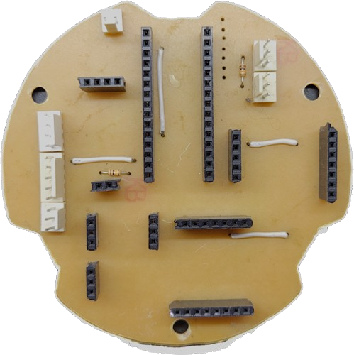
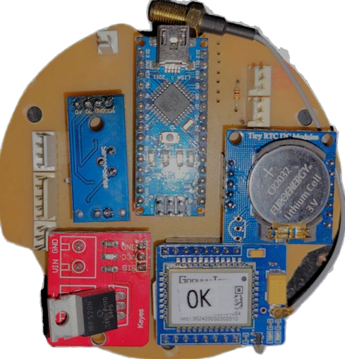

Para cambiar idioma:&nbsp;&nbsp;
 

# Datos² and EME

[Datos²](https://datos2.redesclimaticas.com/) is a platform offered by [OMIXOM](https://www.omixom.com/) that allows for the sharing, storing, and visualization of environmental data from citizen science projects, aiming for an exponential growth of data available to the community.

To contribute to the development of data-collecting devices, OMIXOM has designed [EME](https://github.com/ProyectoDatos2/Datos2/blob/284ac048665ba61753932678cd943c32ad25f8b8/Manual%20de%20uso%20proyecto%20Datos%20correcciones_compressed.pdf) (Educational Meteorological Station), a low-cost and easy-to-assemble meteorological station, ideal for educational projects in technology and environment. EME is equipped with a sensor system, telemetry, and autonomy that allows it to measure variables such as rainfall, temperature, humidity, and UV radiation, uploading this data to the Datos² platform without the need for an electrical network.

 

  
 

## Components and Materials
**Print Settings:**
- Layer Height: 0.2 mm
- Infill: 30% to 50%
- Wall Lines: 3
- Surface Layers: 3

<table align="center"><thead><tr>
      <th>3D Printing</th>
      <th>Quantity</th></tr></thead><tbody><tr>
      <td align="center"><a href = "Impresion 3D STL\Pluviómetro\Pluv_Aro.STL">Ring</a></td>
      <td align="center">1</td></tr><tr>
      <td align="center"><a href = "Impresion 3D STL\Pluviómetro\Pluv_Estanco A.STL">Seal A</a></td>
      <td align="center">1</td></tr><tr>
      <td align="center"><a href = "Impresion 3D STL\Pluviómetro\Pluv_Estanco B.STL">Seal B</a></td>
      <td align="center">1</td></tr><tr>
      <td align="center"><a href = "Impresion 3D STL\Pluviómetro\Pluv_Localizador.STL">Locator</a></td>
      <td align="center">1</td></tr><tr>
      <td align="center"><a href = "Impresion 3D STL\Pluviómetro\Pluv_Mensula.STL">Bracket</a></td>
      <td align="center">1</td></tr><tr>
      <td align="center"><a href = "Impresion 3D STL\Pluviómetro\Pluv_Tapa.STL">Rain Gauge Cover</a></td>
      <td align="center">1</td></tr><tr>
      <td align="center"><a href = "Impresion 3D STL\Pluviómetro\Pluv_Totalizador.STL">Totalizer</a></td>
      <td align="center">1</td></tr><tr>
      <td align="center"><a href = "Impresion 3D STL\Telemetría\Tel_Holder Cargador.STL">Charger Holder</a></td>
      <td align="center">1</td></tr><tr>
      <td align="center"><a href = "Impresion 3D STL\Telemetría\Tel_Holder Step Up.STL">Step-Up Holder</a></td>
      <td align="center">1</td></tr><tr>
      <td align="center"><a href = "Impresion 3D STL\Telemetría\Tel_Pieza T.STL">T-Piece</a></td>
      <td align="center">1</td></tr><tr>
      <td align="center"><a href = "Impresion 3D STL\Telemetría\Tel_Placa Portapilas.STL">Battery Holder Plate</a></td>
      <td align="center">1</td></tr><tr>
      <td align="center"><a href = "Impresion 3D STL\Telemetría\Tel_Separador.STL">Spacer</a></td>
      <td align="center">3</td></tr><tr>
      <td align="center"><a href = "Impresion 3D STL\Telemetría\Tel_Tapa Inferior.STL">Bottom Cover</a></td>
      <td align="center">1</td></tr><tr>
      <td align="center"><a href = "Impresion 3D STL\Telemetría\Tel_Tapa Superior.STL">Top Cover</a></td>
      <td align="center">1</td></tr><tr>
      <td align="center"><a href = "Impresion 3D STL\Telemetría\Tel_Tope.STL">Stoppers</a></td>
      <td align="center">3</td></tr><tr>
      <td align="center"><a href = "Impresion 3D STL\UV\UV_Base.STL">Base</a></td>
      <td align="center">1</td></tr><tr>
      <td align="center"><a href = "Impresion 3D STL\UV\UV_Cuerpo.STL">Body</a></td>
      <td align="center">1</td></tr><tr>
      <td align="center"><a href = "Impresion 3D STL\UV\UV_Tapa.STL">UV Cover</a></td>
      <td align="center">1</td></tr><tr>
      <td align="center"><a href = "Impresion 3D STL\Agarre\Agarre_Fijacion.STL">Fixation</a></td>
      <td align="center">2</td></tr><tr>
      <td align="center"><a href = "Impresion 3D STL\Agarre\Agarre_Mariposa.STL">Butterfly</a></td>
      <td align="center">4</td></tr></tbody></table>

<table align="left"><thead><tr>
      <th>Hardware Store</th>
      <th>Quantity</th></tr></thead><tbody><tr>
      <td align="center"><a href="https://articulo.mercadolibre.com.ar/MLA-935747094-pluviometro-plastico-luft-aro-medidor-lluvia-soporte-pared-_JM#position=8&search_layout=grid&type=item&tracking_id=40f3e3c5-67b8-4b75-a9dc-d82897870d00">Rain Gauge</a></td>
      <td align="center">1 of Ø125 mm</td></tr><tr>
      <td align="center">Screws</td>
      <td align="center"><a href="https://articulo.mercadolibre.com.ar/MLA-1374684557-tornillos-para-electronica-phillips-fresada-m3-x-30mm-x-50u-_JM#position=1&search_layout=stack&type=item&tracking_id=30d64cdf-a3ee-4883-a1f4-83c76c65277d">M3 x 8 mm x 8</a> <a href="https://articulo.mercadolibre.com.ar/MLA-851601087-tornillos-electronica-philips-m4-x-15mm-pack-x-50-unidades-_JM#position=26&search_layout=stack&type=item&tracking_id=d3443aa8-b714-4dcf-8139-188bc350e0b2">M4 x 15 mm x 4</a> <a href="https://www.google.com/search?sca_esv=cfcd3706826e13a2&rlz=1C1ONGR_esAR1060AR1060&q=tornillos+m4+75mm&udm=2&fbs=AEQNm0CbCVgAZ5mWEJDg6aoPVcBgWizR0-0aFOH11Sb5tlNhd7Qv31WAq-g3XdD7m281OKyew6CGJrEYYQ4lESOC_x5KkE_SDY1zOtKTls3hovcNa6l_ItgJaIBwjFlejPm39w49Y4BxxGyRdKxxx_9klNmppRGjpVAmC2paJxmKME9gKCeweFeHNk13bUsJGMlkFsW02nTigN9iX_s4ABlGPJPAolXpcg&sa=X&ved=2ahUKEwixkavpgPWGAxWaO7kGHWEMB-gQtKgLegQIEBAB&biw=1366&bih=651&dpr=1">M4 x 75 mm x 3</a> <a href="https://articulo.mercadolibre.com.ar/MLA-1161252470-bulon-tornillo-motor-m6-x-45mm-exagono-8mm-tornado-shop-_JM#position=4&search_layout=stack&type=item&tracking_id=4b230858-6045-4172-8137-ba08bb35db4a">M6 x 45 mm x 2</a></td></tr><tr>
      <td align="center">Nuts</td>
      <td align="center"><a href="https://articulo.mercadolibre.com.ar/MLA-1530972980-tuerca-cuadrada-m4-llavelado-78mm-altura-3mm-x50u-_JM#position=2&search_layout=grid&type=item&tracking_id=8fbc1ed0-af53-4e58-b601-2e823bb12032">M3 x 2</a> <a href="https://articulo.mercadolibre.com.ar/MLA-852569160-tuercas-hexagonales-532-zincadas-x-100-unidades-_JM#position%3D2%26search_layout%3Dgrid%26type%3Ditem%26tracking_id%3D808f21d1-e294-4f1d-9b41-2d7305fe95dc">5/32" x 16</a> <a href="https://articulo.mercadolibre.com.ar/MLA-1754670680-tuerca-metrica-m6-x-1-por-100u-_JM#position=10&search_layout=grid&type=item&tracking_id=58a8e696-384b-4eec-be72-f6eadc923bd2">M6 x 2</a></td></tr><tr>
      <td align="center"><a href="https://articulo.mercadolibre.com.ar/MLA-1620376638-arandela-plana-de-aluminio-532-m4-espesor-08mm-x50u-_JM#position%3D1%26search_layout%3Dstack%26type%3Ditem%26tracking_id%3D5e5c01d7-a419-4e4b-b1ac-a45996fed0d7">Washer</a></td>
      <td align="center">M4 x 4</td></tr><tr>
      <td align="center"><a href="https://articulo.mercadolibre.com.ar/MLA-856438789-varilla-roscada-zincada-metrica-4-mm-x-1-metro-5-unid-_JM#position=44&search_layout=grid&type=item&tracking_id=8f69ecda-bf72-4896-88bf-04332535ec9a">Threaded Rod</a></td>
      <td align="center">5/32" x 65 mm x 3</a> 5/32" x 210 mm x 3</td></tr><tr>
      <td align="center"><a href="https://articulo.mercadolibre.com.ar/MLA-1392845759-cable-plano-de-linea-telefono-4mts-rj11-4-hilos-_JM?attributes=COLOR_SECONDARY_COLOR%3ATmVncm8%3D&quantity=1">4-Wire Cable</a></td>
      <td align="center">3 m</td></tr><tr>
      <td align="center"><a href="https://articulo.mercadolibre.com.ar/MLA-1110851260-prensacables-12-plasticopvcnylon-x10-unidades-_JM#position=13&search_layout=grid&type=item&tracking_id=16fe9a83-f60b-4a61-9817-195cd61cc1a3">Plastic Cable Gland 1/2</a></td>
      <td align="center">6</td></tr><tr>
      <td align="center"><a href="https://www.herrerocons.es/producto/manguito-union-tubo-pvc-110mm-claro-cod-1000717/">PVC Union Tube 110 mm</a></td>
      <td align="center">1</td></tr><tr>
      <td align="center"><a href="https://articulo.mercadolibre.com.ar/MLA-1137150523-junta-o-ring-goma-diametro-exterior-110mm-y-35mm-espesor-_JM#position=50&search_layout=stack&type=item&tracking_id=8d5f25ba-2ce8-458a-8c3f-09c2b75aed30">O-Ring Ø110 mm</a></td>
      <td align="center">2</td></tr><tr>
      <td align="center"><a href="https://www.mercadolibre.com.ar/cristal-repuesto-lentes-para-soldar-truper/p/MLA26196668">Welding Glass</a></td>
      <td align="center">1</td></tr><tr>
      <td align="center"><a href="https://articulo.mercadolibre.com.ar/MLA-926213442-termocontraible-negro-6-mm-contrae-a-3-mm-por-1-metro-_JM#position=24&search_layout=stack&type=item&tracking_id=e86bf665-c37a-4c91-992f-f2ff9ed5f905">Heat Shrink Ø3 mm</a></td>
      <td align="center">30 cm</td></tr><tr>
      <td align="center"><a href="https://www.mercadolibre.com.ar/sellador-tacsa-silicona-acetica-color-transparente/p/MLA27649062#searchVariation=MLA27649062&position=3&search_layout=stack&type=product&tracking_id=52e10322-f6e2-4aa6-902a-391dd70c1d53">Silicone</a></td>
      <td align="center">A Little</td></tr><tr>
      <td align="center"><a href="https://www.mercadolibre.com.ar/ciano-pegamento-cianoacrilato-pegalo-x-20g/p/MLA27158011#searchVariation%3DMLA27158011%26position%3D5%26search_layout%3Dgrid%26type%3Dproduct%26tracking_id%3D0c2b4bc9-f7d2-4973-9d52-3ae95d5a8a25">Instant Glue</a></td>
      <td align="center">A Little</td></tr><tr>
      <td align="center"><a href="https://articulo.mercadolibre.com.ar/MLA-1320701568-acuarel-interior-y-exterior-latex-x-1-lt-_JM?attributes=COLOR_SECONDARY_COLOR%3AVmVyZGUgRm9yZXN0YWw%3D&quantity=1">Latex Paint</a></td>
      <td align="center">A Little</td></tr></tbody></table>

Got it! Here's the translation without corrections:

<table align="center">
  <thead>
    <tr>
      <th>Components</th>
      <th>Quantity</th>
    </tr>
  </thead>
  <tbody>
    <tr>
      <td align="center"><a href="https://www.trvstore.com/paneles-solares/113-mod-fotovoltaico-15-wp-18v-083a-16mm-tipo-szyl-p15-18c.html">Panel Solar</a></td>
      <td align="center">1</td>
    </tr>
    <tr>
      <td align="center"><a href="https://articulo.mercadolibre.com.ar/MLA-1117390716-atmel-nano-v30-atmega328-usb-compatible-ch340-cable-usb-_JM#position=4&search_layout=grid&type=item&tracking_id=72562e09-0b68-4055-bb07-b63051b15a30">Arduino Nano</a></td>
      <td align="center">1</td>
    </tr>
    <tr>
      <td align="center"><a href="https://articulo.mercadolibre.com.ar/MLA-677999119-fuente-step-up-mt3608-dc-dc-booster-hasta-28v-arduino-_JM#position=5&search_layout=grid&type=item&tracking_id=8fe16bd9-8071-4581-baf5-30e2aaf3523e">Step-Up MT3608</a></td>
      <td align="center">1</td>
    </tr>
    <tr>
      <td align="center"><a href="https://articulo.mercadolibre.com.ar/MLA-732240129-modulo-driver-mosfet-irf520-24v-9a-controlador-arduino-pic-_JM#position=2&search_layout=grid&type=item&tracking_id=4971c395-66a7-4063-87e5-2919493828b4">Driver Mosfet IRF520</a></td>
      <td align="center">1</td>
    </tr>
    <tr>
      <td align="center"><a href="https://articulo.mercadolibre.com.ar/MLA-628919809-sensor-de-lluvia-raindrop-nivel-de-agua-gotas-arduino-pic-_JM#position=1&search_layout=stack&type=item&tracking_id=30c9dd6e-3289-46bd-bf59-e12049e01e5d">Rain Sensor</a></td>
      <td align="center">1</td>
    </tr>
    <tr>
      <td align="center"><a href="https://articulo.mercadolibre.com.ar/MLA-652467602-reloj-tiempo-real-rtc-ds1307-eeprom-24c32-arduino-todom">RTC DS1307</a></td>
      <td align="center">1</td>
    </tr>
    <tr>
      <td align="center"><a href="https://www.mercadolibre.com.ar/pila-samsung-inr18650-30q-cilindrica-1-unidad/p/MLA16952001#searchVariation=MLA16952001&position=1&search_layout=stack&type=product&tracking_id=262fdb61-1f61-41e8-b207-c581f31320b5">18650 Samsung Batteries</a></td>
      <td align="center">2</td>
    </tr>
    <tr>
      <td align="center"><a href="https://articulo.mercadolibre.com.ar/MLA-810911247-10-portapilas-holder-bateria-18650-portapila-pack-x-10-_JM#position=36&search_layout=stack&type=item&tracking_id=58fa4027-1cb1-4b2d-b6bb-21a118f22569">Battery Holder</a></td>
      <td align="center">2</td>
    </tr>
    <tr>
      <td align="center"><a href="https://articulo.mercadolibre.com.ar/MLA-767685589-dht-22-sensor-humedad-y-temperatura-arduino-raspberry-_JM#position=1&search_layout=grid&type=item&tracking_id=bb4ca5b0-af4a-41e8-9012-47ee587c1c7a">DHT22 Temperature and Humidity Sensor</a></td>
      <td align="center">1</td>
    </tr>
    <tr>
      <td align="center"><a href="https://articulo.mercadolibre.com.ar/MLA-921895103-modulo-sensor-luz-ultravioleta-uv-ml8511-arduino-_JM#position=6&search_layout=grid&type=item&tracking_id=b31fa0ab-c297-4237-8fd0-921482750ff8">ML8511 UV Light Sensor</a></td>
      <td align="center">1</td>
    </tr>
    <tr>
      <td align="center"><a href="https://articulo.mercadolibre.com.ar/MLA-1437846022-modulo-gprs-a6-mini-cuatribanda-sms-gsm-gprs-ideal-arduino-_JM#position=31&search_layout=stack&type=item&tracking_id=b92e1ad1-eb10-41e8-8f06-538f5c0ab563">A6 Mini GPRS Modem</a> | <a href="https://articulo.mercadolibre.com.ar/MLA-1308505021-modulo-celular-gsm-gprs-sim800l-sim800-domotica-arduino-ubot-_JM#position=1&search_layout=grid&type=item&tracking_id=351d4014-7b06-4f31-87f1-ae97d6f6fd73">SIM800L</a></td>
      <td align="center">1</td>
    </tr>
    <tr>
      <td align="center"><a href="https://articulo.mercadolibre.com.ar/MLA-1106257985-cargador-bateria-lipo-uso-panel-solar-cn3791-arduino-elegir-_JM#position=30&search_layout=stack&type=item&tracking_id=802ccaf1-c51f-4cb6-aa45-b20c71b1849a">CN3791 Solar Charger</a></td>
      <td align="center">1</td>
    </tr>
    <tr>
      <td align="center"><a href="https://articulo.mercadolibre.com.ar/MLA-733004040-celda-de-carga-10kg-con-amplificador-hx711-arduino-candy-_JM#position=14&search_layout=grid&type=item&tracking_id=8e1c6a0c-bf37-4eee-bc3d-d1f6ae97d8ef">10Kg Load Cell with HX711 Driver</a></td>
      <td align="center">1</td>
    </tr>
    <tr>
      <td align="center">Molex Kit</td>
      <td align="center"><a href="https://articulo.mercadolibre.com.ar/MLA-1530414156-kit-x-30u-2-pin-terminal-molex-hembra-macho-y-pines-htec-_JM#position=3&search_layout=grid&type=item&tracking_id=feedb67d-d999-4e10-83dc-8528ae580bf2">2 pins x 1</a> <a href="https://articulo.mercadolibre.com.ar/MLA-1547547796-kit-x-30u-3-pin-terminal-molex-hembra-macho-y-pines-htec-_JM#position=51&search_layout=stack&type=item&tracking_id=4f2edef0-6c5c-400e-8229-65fce00075ec">3 pins x 3</a> <a href="https://articulo.mercadolibre.com.ar/MLA-1544835568-kit-x-30u-4-pin-terminal-molex-hembra-macho-y-pines-htec-_JM#position=1&search_layout=grid&type=item&tracking_id=8ec89334-1835-4339-9225-2a076de11fa3">4 pins x 1</a> <a href="https://articulo.mercadolibre.com.ar/MLA-1548402732-kit-x-30u-5-pin-terminal-molex-hembra-macho-y-pines-htec-_JM#position=2&search_layout=grid&type=item&tracking_id=0542de33-9c89-4d24-a9b2-bdc8694cdf21">5 pins x 1</a></td>
    </tr>
    <tr>
      <td align="center"><a href="https://articulo.mercadolibre.com.ar/MLA-841986521-10-x-resistencias-10k-ohm-1-14w-metal-film-_JM#position=8&search_layout=grid&type=item&tracking_id=424a52a9-8c38-42ca-8fbc-487ac3932614">10 KΩ Resistors</a></td>
      <td align="center">2</td>
    </tr>
    <tr>
      <td align="center"><a href="https://articulo.mercadolibre.com.ar/MLA-879655442-tira-de-40-pines-hembra-paso-254mm-recta-1-fila-_JM#position=4&search_layout=grid&type=item&tracking_id=f194ae8c-4a52-457f-882d-bc9aa2cb7714">Female Pin Strip</a></td>
      <td align="center">2</td>
    </tr>
    <tr>
      <td align="center"><a href="https://articulo.mercadolibre.com.ar/MLA-1457486094-llave-electronica-tecla-interruptora-redonda-alcides-2500-_JM#position=1&search_layout=stack&type=item&tracking_id=a7d7d1b3-e35b-4af4-bd44-98e7a9482798">On/Off Switch</a></td>
      <td align="center">1</td>
    </tr>
    <tr>
      <td align="center"><a href="https://tienda.ityt.com.ar/antenas-gsm-2g-3g-4g/8259-antena-modem-2g-3g-4g-lte-exterior-cable-5m-sma-itytarg.html">3G Antenna</a></td>
      <td align="center">1</td>
    </tr>
    <tr>
      <td align="center"><a href="https://articulo.mercadolibre.com.ar/MLA-740053599-cable-pigtail-ufl-ipx-a-sma-hembra-cable-antena-15-cm-_JM#position=2&search_layout=stack&type=item&tracking_id=59d777cc-f65b-4182-b457-41c2329058b1">Pigtail SMA to U.fl Adapter</a></td>
      <td align="center">1</td>
    </tr>
    <tr>
      <td align="center"><a href="https://articulo.mercadolibre.com.ar/MLA-840122267-5-x-pilas-boton-cr2032-vinnic-2032-san-martin-caseros-_JM#position=12&search_layout=stack&type=item&tracking_id=319399d4-d1e2-4e31-b8e0-133f9c6257ec">CR2032 Battery</a></td>
      <td align="center">1</td>
    </tr>
    <tr>
      <td align="center"><a href="https://articulo.mercadolibre.com.ar/MLA-1248406422-chip-prepago-movistar-personal-claro-tuenti-gsm-4g-_JM#position=5&search_layout=stack&type=item&tracking_id=6764688f-a6c5-4715-9250-fc3602753aae">SIM Card</a></td>
      <td align="center">1</td>
    </tr>
  </tbody>
</table>

## PCB Assembly

1. [Create the PCB](https://youtu.be/MX9_9U6Wnu8?si=8ijrH3XqB462RJCx&t=36) with this [circuit](SEHMA/Arduino_Nano+A6mini_GPRS/Hardware/PCB_Datos2.pdf).

2. Drill the PCB with a 1 mm bit, as follows:

  
  

3. Check for continuity where there should be and ensure there is no continuity where there should not be.

4. Solder female pins, resistors, and wires as follows:

  

5. Send an email to soporte@omixom.com to obtain your serial number.

6. [Install](https://docs.arduino.cc/software/ide-v1/tutorials/installing-libraries/) the [libraries](https://github.com/ProyectoDatos2/Datos2/tree/284ac048665ba61753932678cd943c32ad25f8b8/SEHMA/Arduino_Nano%2BA6mini_GPRS/Firmware/Estacion_v1.4_1hora/Librerias) and [upload](https://docs.arduino.cc/software/ide-v2/tutorials/getting-started/ide-v2-uploading-a-sketch/) the [program](https://github.com/ProyectoDatos2/Datos2/blob/284ac048665ba61753932678cd943c32ad25f8b8/SEHMA/Arduino_Nano%2BA6mini_GPRS/Firmware/Estacion_v1.4_1hora/Estacion_v1.4_1hora.ino) (modify line 30 with your serial number) in the [Arduino](https://articulo.mercadolibre.com.ar/MLA-1117390716-atmel-nano-v30-atmega328-usb-compatible-ch340-cable-usb-_JM#position=4&search_layout=grid&type=item&tracking_id=72562e09-0b68-4055-bb07-b63051b15a30).

7. Place the [Arduino](https://articulo.mercadolibre.com.ar/MLA-1117390716-atmel-nano-v30-atmega328-usb-compatible-ch340-cable-usb-_JM#position=4&search_layout=grid&type=item&tracking_id=72562e09-0b68-4055-bb07-b63051b15a30), the [rain sensor](https://articulo.mercadolibre.com.ar/MLA-628919809-sensor-de-lluvia-raindrop-nivel-de-agua-gotas-arduino-pic-_JM#position=1&search_layout=stack&type=item&tracking_id=30c9dd6e-3289-46bd-bf59-e12049e01e5d), the [MOSFET driver](https://articulo.mercadolibre.com.ar/MLA-732240129-modulo-driver-mosfet-irf520-24v-9a-controlador-arduino-pic-_JM#position=2&search_layout=grid&type=item&tracking_id=4971c395-66a7-4063-87e5-2919493828b4), the [modem](https://articulo.mercadolibre.com.ar/MLA-1437846022-modulo-gprs-a6-mini-cuatribanda-sms-gsm-gprs-ideal-arduino-_JM#position=31&search_layout=stack&type=item&tracking_id=b92e1ad1-eb10-41e8-8f06-538f5c0ab563) (attach a [pigtail adapter](https://articulo.mercadolibre.com.ar/MLA-740053599-cable-pigtail-ufl-ipx-a-sma-hembra-cable-antena-15-cm-_JM#position=2&search_layout=stack&type=item&tracking_id=59d777cc-f65b-4182-b457-41c2329058b1) and a [SIM card](https://articulo.mercadolibre.com.ar/MLA-1248406422-chip-prepago-movistar-personal-claro-tuenti-gsm-4g-_JM#position=5&search_layout=stack&type=item&tracking_id=6764688f-a6c5-4715-9250-fc3602753aae)) and the [RTC](https://articulo.mercadolibre.com.ar/MLA-652467602-reloj-tiempo-real-rtc-ds1307-eeprom-24c32-arduino-todom) (insert the [battery](https://articulo.mercadolibre.com.ar/MLA-840122267-5-x-pilas-boton-cr2032-vinnic-2032-san-martin-caseros-_JM#position=12&search_layout=stack&type=item&tracking_id=319399d4-d1e2-4e31-b8e0-133f9c6257ec)).

  
 

## Autonomy System

1. Set the [Step-Up](https://articulo.mercadolibre.com.ar/MLA-677999119-fuente-step-up-mt3608-dc-dc-booster-hasta-28v-desarrollo-_JM#position=5&search_layout=grid&type=item&tracking_id=8fe16bd9-8071-4581-baf5-30e2aaf3523e) to 5V.

2. Glue with instant glue: the [solar charger](https://articulo.mercadolibre.com.ar/MLA-1106257985-cargador-bateria-lipo-uso-panel-solar-cn3791-arduino-elegir-_JM#position=30&search_layout=stack&type=item&tracking_id=802ccaf1-c51f-4cb6-aa45-b20c71b1849a) to [its holder](https://github.com/ProyectoDatos2/Datos2/blob/fe523a1e2fe9d67b9b7c4fb0a8531aeb061aca14/Impresion%203D%20STL/Telemetr%C3%ADa/Tel_Holder%20Cargador.STL), the [Step-Up](https://articulo.mercadolibre.com.ar/MLA-677999119-fuente-step-up-mt3608-dc-dc-booster-hasta-28v-desarrollo-_JM#position=5&search_layout=grid&type=item&tracking_id=8fe16bd9-8071-4581-baf5-30e2aaf3523e) to [its holder](https://github.com/ProyectoDatos2/Datos2/blob/fe523a1e2fe9d67b9b7c4fb0a8531aeb061aca14/Impresion%203D%20STL/Telemetr%C3%ADa/Tel_Holder%20Step%20Up.STL), and the [battery holders](https://articulo.mercadolibre.com.ar/MLA-810911247-10-portapilas-holder-bateria-18650-portapila-pack-x-10-_JM#position=36&search_layout=stack&type=item&tracking_id=58fa4027-1cb1-4b2d-b6bb-21a118f22569) and holders to the [battery holder plate](https://github.com/ProyectoDatos2/Datos2/blob/fe523a1e2fe9d67b9b7c4fb0a8531aeb061aca14/Impresion%203D%20STL/Telemetr%C3%ADa/Tel_Placa%20Portapilas.STL).

  

3. Connect a [2-pin Molex cable](https://www.google.com/search?sca_esv=37db28bfa134011b&rlz=1C1ONGR_esAR1060AR1060&q=cable+molex+de+2+pines&udm=2&fbs=AEQNm0CbCVgAZ5mWEJDg6aoPVcBgWizR0-0aFOH11Sb5tlNhd7Qv31WAq-g3XdD7m281OKyew6CGJrEYYQ4lESOC_x5KkE_SDY1zOtKTls3hovcNa6l_ItgJaIBwjFlejPm39w49Y4BxxGyRdKxxx_9klNmppRGjpVAmC2paJxmKME9gKCeweFeHNk13bUsJGMlkFsW02nTigN9iX_s4ABlGPJPAolXpcg&sa=X&ved=2ahUKEwi2udTDtPeGAxW8qZUCHSHgAloQtKgLegQIDxAB&biw=1366&bih=651&dpr=1) to all the inputs and outputs of the solar charger.

4. Connect the upper output of the solar charger to the battery holders.

  

 
5. Connect the negative of the lower output of the solar charger to the negative of the input of the Step-Up module.

  

 
6. Place a [4-wire cable](https://articulo.mercadolibre.com.ar/MLA-1392845759-cable-plano-de-linea-telefono-4mts-rj11-4-hilos-_JM?attributes=COLOR_SECONDARY_COLOR%3ATmVncm8%3D&quantity=1) of 10 cm on the Step-Up output, with 2 wires connecting to the positive and the other 2 to the negative.

  
 

## UV Sensor

1. Solder a [30 cm 4-wire cable](https://articulo.mercadolibre.com.ar/MLA-1392845759-cable-plano-de-linea-telefono-4mts-rj11-4-hilos-_JM?attributes=COLOR_SECONDARY_COLOR%3ATmVncm8%3D&quantity=1) to the [UV sensor](https://articulo.mercadolibre.com.ar/MLA-921895103-modulo-sensor-luz-ultravioleta-uv-ml8511-arduino-_JM#position=6&search_layout=grid&type=item&tracking_id=b31fa0ab-c297-4237-8fd0-921482750ff8) as follows:

  

2. Screw the sensor to its [base](https://github.com/ProyectoDatos2/Datos2/blob/mati-etche/Impresion%203D%20STL/UV/UV_Base.STL) (pass the cable through the hole) and the base to the [body](https://github.com/ProyectoDatos2/Datos2/blob/mati-etche/Impresion%203D%20STL/UV/UV_Cuerpo.STL) using [M3 8mm screws](https://articulo.mercadolibre.com.ar/MLA-1374684557-tornillos-para-electronica-phillips-fresada-m3-x-30mm-x-50u-_JM#position=1&search_layout=stack&type=item&tracking_id=30d64cdf-a3ee-4883-a1f4-83c76c65277d). Glue the [glass](https://www.mercadolibre.com.ar/cristal-repuesto-lentes-para-soldar-truper/p/MLA26196668) to the body with instant glue and place the [UV cover](https://github.com/ProyectoDatos2/Datos2/blob/mati-etche/Impresion%203D%20STL/UV/UV_Tapa.STL) on top.

  
 

  Here’s the translated text with the formatting preserved:

---

## Rain Gauge

1. Screw the [locator](https://github.com/ProyectoDatos2/Datos2/blob/mati-etche/Impresion%203D%20STL/Pluvi%C3%B3metro/Pluv_Localizador.STL) to the [load cell](https://articulo.mercadolibre.com.ar/MLA-733004040-celda-de-carga-10kg-con-amplificador-hx711-arduino-candy-_JM#position=14&search_layout=grid&type=item&tracking_id=8e1c6a0c-bf37-4eee-bc3d-d1f6ae97d8ef) with double washers and [M4 15 mm screws](https://articulo.mercadolibre.com.ar/MLA-851601087-tornillos-electronica-philips-m4-x-15mm-pack-x-50-unidades-_JM#position=26&search_layout=stack&type=item&tracking_id=d3443aa8-b714-4dcf-8139-188bc350e0b2). Screw the load cell to the [totalizer](https://github.com/ProyectoDatos2/Datos2/blob/mati-etche/Impresion%203D%20STL/Pluvi%C3%B3metro/Pluv_Totalizador.STL) from below with a M4 15 mm screw.

  
  

2. Connect the load cell and a [40 cm 4-wire cable](https://articulo.mercadolibre.com.ar/MLA-1392845759-cable-plano-de-linea-telefono-4mts-rj11-4-hilos-_JM?attributes=COLOR_SECONDARY_COLOR%3ATmVncm8%3D&quantity=1) to its driver as follows:

  

3. Place the driver inside [estanco A](https://github.com/ProyectoDatos2/Datos2/blob/mati-etche/Impresion%203D%20STL/Pluvi%C3%B3metro/Pluv_Estanco%20A.STL), apply [silicone](https://www.mercadolibre.com.ar/sellador-tacsa-silicona-acetica-color-transparente/p/MLA27649062#searchVariation=MLA27649062&position=3&search_layout=stack&type=product&tracking_id=52e10322-f6e2-4aa6-902a-391dd70c1d53), cover with [estanco B](https://github.com/ProyectoDatos2/Datos2/blob/mati-etche/Impresion%203D%20STL/Pluvi%C3%B3metro/Pluv_Estanco%20B.STL), and place it next to the load cell.

  
  

4. Install the [210 mm threaded rods](https://articulo.mercadolibre.com.ar/MLA-856438789-varilla-roscada-zincada-metrica-4-mm-x-1-metro-5-unid-_JM#position=44&search_layout=grid&type=item&tracking_id=8f69ecda-bf72-4896-88bf-04332535ec9a) with [5/32" nuts](https://articulo.mercadolibre.com.ar/MLA-852569160-tuercas-hexagonales-532-zincadas-x-100-unidades-_JM#position%3D2%26search_layout%3Dgrid%26type%3Ditem%26tracking_id%3D808f21d1-e294-4f1d-9b41-2d7305fe95dc) on the totalizer, then place the [rain gauge cover](https://github.com/ProyectoDatos2/Datos2/blob/mati-etche/Impresion%203D%20STL/Pluvi%C3%B3metro/Pluv_Tapa.STL) and secure with 5/32" nuts.

  
  

5. Paint the [raindrop](https://articulo.mercadolibre.com.ar/MLA-628919809-sensor-de-lluvia-raindrop-nivel-de-agua-gotas-arduino-pic-_JM#position=1&search_layout=stack&type=item&tracking_id=30c9dd6e-3289-46bd-bf59-e12049e01e5d) with [latex paint](https://articulo.mercadolibre.com.ar/MLA-1320701568-acuarel-interior-y-exterior-latex-x-1-lt-_JM?attributes=COLOR_SECONDARY_COLOR%3AVmVyZGUgRm9yZXN0YWw%3D&quantity=1), solder a 60 cm 4-wire cable (2 wires on one pad and 2 wires on the other) to it, and screw it onto the [bracket](https://github.com/ProyectoDatos2/Datos2/blob/mati-etche/Impresion%203D%20STL/Pluvi%C3%B3metro/Pluv_Mensula.STL) with [M3 8 mm screws](https://articulo.mercadolibre.com.ar/MLA-1374684557-tornillos-para-electronica-phillips-fresada-m3-x-30mm-x-50u-_JM#position=1&search_layout=stack&type=item&tracking_id=30d64cdf-a3ee-4883-a1f4-83c76c65277d).

  

6. Place the bracket and the [ring](https://github.com/ProyectoDatos2/Datos2/blob/mati-etche/Impresion%203D%20STL/Pluvi%C3%B3metro/Pluv_Aro.STL) on the rods. Level the ring by adjusting the nuts.

  
  
  
  
 

## Integration of Electrical Systems

1. On the [bottom cover](https://github.com/ProyectoDatos2/Datos2/blob/mati-etche/Impresion%203D%20STL/Telemetr%C3%ADa/Tel_Tapa%20Inferior.STL): place the [O-Ring](https://articulo.mercadolibre.com.ar/MLA-1137150523-junta-o-ring-goma-diametro-exterior-110mm-y-35mm-espesor-_JM#position=50&search_layout=stack&type=item&tracking_id=8d5f25ba-2ce8-458a-8c3f-09c2b75aed30), screw in the [65 mm rods](https://articulo.mercadolibre.com.ar/MLA-856438789-varilla-roscada-zincada-metrica-4-mm-x-1-metro-5-unid-_JM#position=44&search_layout=grid&type=item&tracking_id=8f69ecda-bf72-4896-88bf-04332535ec9a), glue the [T-piece](https://github.com/ProyectoDatos2/Datos2/blob/mati-etche/Impresion%203D%20STL/Telemetr%C3%ADa/Tel_Pieza%20T.STL) with instant glue, and insert the [cable glands](https://articulo.mercadolibre.com.ar/MLA-1110851260-prensacables-12-plasticopvcnylon-x10-unidades-_JM#position=13&search_layout=grid&type=item&tracking_id=16fe9a83-f60b-4a61-9817-195cd61cc1a3) and the [switch](https://articulo.mercadolibre.com.ar/MLA-1457486094-llave-electronica-tecla-interruptora-redonda-alcides-2500-_JM#position=1&search_layout=stack&type=item&tracking_id=a7d7d1b3-e35b-4af4-bd44-98e7a9482798).

  

2. Cut the pins of the [DHT](https://articulo.mercadolibre.com.ar/MLA-767685589-dht-22-sensor-humedad-y-temperatura-arduino-raspberry-_JM#position=1&search_layout=grid&type=item&tracking_id=bb4ca5b0-af4a-41e8-9012-47ee587c1c7a) in half, solder a 20 cm 4-wire cable to the pins using heat shrink tubing, and glue it to the T-piece with instant glue.

  

3. On the right side of the switch, solder a [4-wire cable](https://articulo.mercadolibre.com.ar/MLA-1392845759-cable-plano-de-linea-telefono-4mts-rj11-4-hilos-_JM?attributes=COLOR_SECONDARY_COLOR%3ATmVncm8%3D&quantity=1) with 11 cm splices. On the left side, solder a 4-wire cable with 11 cm splices and a 12 cm wire.

  

4. Pass the cables through the cable glands as shown in the image. To pass the [SMA antenna connector](https://tienda.ityt.com.ar/antenas-gsm-2g-3g-4g/8259-antena-modem-2g-3g-4g-lte-exterior-cable-5m-sma-itytarg.html), drill the cable gland (without the rubber) with a 9.5 mm drill bit. Wrap 7 turns of electrical tape where the rubber would go, pass the SMA connector through the cable gland, connect it to the [SMA pigtail](https://articulo.mercadolibre.com.ar/MLA-740053599-cable-pigtail-ufl-ipx-a-sma-hembra-cable-antena-15-cm-_JM#position=2&search_layout=stack&type=item&tracking_id=59d777cc-f65b-4182-b457-41c2329058b1) of the modem, and wrap some electrical tape around the metal part.

  
  
  

5. Place the PCB on the metal rods as shown in the image and assemble the Molex connectors as follows:

<table align="center"><thead><tr>
      <th>Molex</th>
      <th>Pin</th>
      <th>Usage</th></tr></thead><tbody><tr>
      <td align="center">Load Cell Driver</td>
      <td align="center">1 2 3 4</td>
      <td align="center">CLK Data GND VCC</td></tr><tr>
      <td align="center">UV Light Sensor</td>
      <td align="center">5 6 7 8 9</td>
      <td align="center">GND 3.3 V ENABLE NC Data</td></tr><tr>
      <td align="center">Switch + Raindrop</td>
      <td align="center">10 11 12</td>
      <td align="center">Battery Voltage Raindrop 1 Raindrop 2</td></tr><tr>
      <td align="center">Humidity and Temperature Sensor</td>
      <td align="center">13 14 15</td>
      <td align="center">Data GND VCC</td></tr><tr>
      <td align="center">Step-Up Output</td>
      <td align="center">16 17</td>
      <td align="center">VCC GND</td></tr></tbody></table>

6. Place the [spacers](https://github.com/ProyectoDatos2/Datos2/blob/mati-etche/Impresion%203D%20STL/Telemetr%C3%ADa/Tel_Separador.STL), the autonomy system, and [5/32" nuts](https://articulo.mercadolibre.com.ar/MLA-852569160-tuercas-hexagonales-532-zincadas-x-100-unidades-_JM#position%3D2%26search_layout%3Dgrid%26type%3Ditem%26tracking_id%3D808f21d1-e294-4f1d-9b41-2d7305fe95dc) on the metal rods.

  

7. Connect the 4-wire cable on the right side of the switch to the positive terminal of the lower output of the [solar charger](https://articulo.mercadolibre.com.ar/MLA-1106257985-cargador-bateria-lipo-uso-panel-solar-cn3791-arduino-elegir-_JM#position=30&search_layout=stack&type=item&tracking_id=802ccaf1-c51f-4cb6-aa45-b20c71b1849a). Solder the 4-wire cable on the left side of the switch to the positive terminal of the [Step-Up](https://articulo.mercadolibre.com.ar/MLA-677999119-fuente-step-up-mt3608-dc-dc-booster-hasta-28v-arduino-_JM#position=5&search_layout=grid&type=item&tracking_id=8fe16bd9-8071-4581-baf5-30e2aaf3523e) input.

  
 

8. Connect the solar charger inputs to the solar panel.

  
 