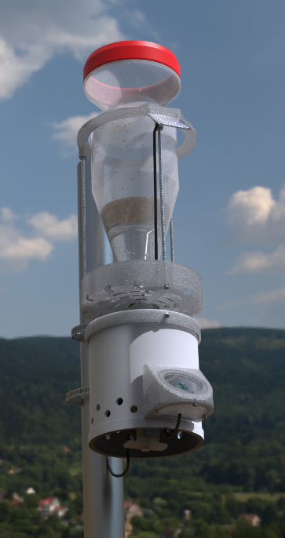
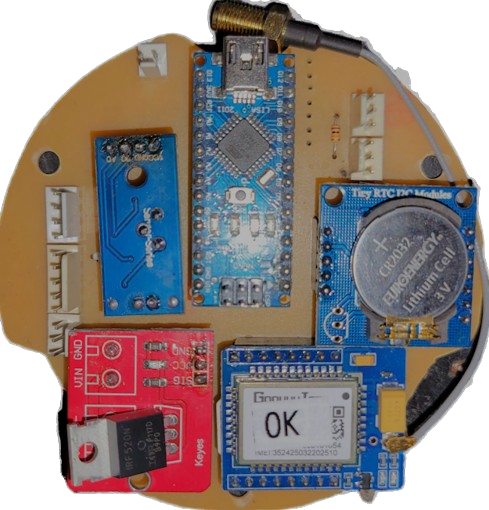

To change language:&nbsp;&nbsp;

# Datos² y EME

[Datos²](https://datos2.redesclimaticas.com/) es una plataforma ofrecida por [OMIXOM](https://www.omixom.com/) que permite compartir, almacenar y visualizar datos ambientales provenientes de proyectos de ciencia ciudadana con el objetivo de tener un crecimiento exponencial de datos a disposición de la comunidad.

Para contribuir al desarrollo de dispositivos que tomen datos, OMIXOM ha diseñado [EME](https://github.com/ProyectoDatos2/Datos2/blob/284ac048665ba61753932678cd943c32ad25f8b8/Manual%20de%20uso%20proyecto%20Datos%20correcciones_compressed.pdf) (Estación Meteorológica de uso Educativo), una estación meteorológica de bajo costo y fácil ensamblaje, ideal para proyectos educativos de tecnología y medio ambiente. EME está equipada con un sistema de sensores, telemetría y autonomía que permite medir variables como lluvia, temperatura, humedad y radiación UV, subiendo estos datos a la plataforma de Datos² sin necesidad de una red eléctrica.

 

  
 

## Componentes y materiales
**Configuración de Impresión:**
- Altura de Capa: 0,2 mm
- Relleno: 30% al 50%
- Líneas de pared: 3
- Capas de Superficie: 3

<table align="center"><thead><tr>
      <th>Impresión 3D</th>
      <th>Cantidad</th></tr></thead><tbody><tr>
      <td align="center"><a href = "Impresion 3D STL\Pluviómetro\Pluv_Aro.STL">Aro</a></td>
      <td align="center">1</td></tr><tr>
      <td align="center"><a href = "Impresion 3D STL\Pluviómetro\Pluv_Estanco A.STL">Estanco A</a></td>
      <td align="center">1</td></tr><tr>
      <td align="center"><a href = "Impresion 3D STL\Pluviómetro\Pluv_Estanco B.STL">Estanco B</a></td>
      <td align="center">1</td></tr><tr>
      <td align="center"><a href = "Impresion 3D STL\Pluviómetro\Pluv_Localizador.STL">Localizador</a></td>
      <td align="center">1</td></tr><tr>
      <td align="center"><a href = "Impresion 3D STL\Pluviómetro\Pluv_Mensula.STL">Ménsula</a></td>
      <td align="center">1</td></tr><tr>
      <td align="center"><a href = "Impresion 3D STL\Pluviómetro\Pluv_Tapa.STL">Tapa pluviómetro</a></td>
      <td align="center">1</td></tr><tr>
      <td align="center"><a href = "Impresion 3D STL\Pluviómetro\Pluv_Totalizador.STL">Totalizador</a></td>
      <td align="center">1</td></tr><tr>
      <td align="center"><a href = "Impresion 3D STL\Telemetría\Tel_Holder Cargador.STL">Holder Cargador</a></td>
      <td align="center">1</td></tr><tr>
      <td align="center"><a href = "Impresion 3D STL\Telemetría\Tel_Holder Step Up.STL">Holder Step-Up</a></td>
      <td align="center">1</td></tr><tr>
      <td align="center"><a href = "Impresion 3D STL\Telemetría\Tel_Pieza T.STL">Pieza en T</a></td>
      <td align="center">1</td></tr><tr>
      <td align="center"><a href = "Impresion 3D STL\Telemetría\Tel_Placa Portapilas.STL">Placa Porta Pila</a></td>
      <td align="center">1</td></tr><tr>
      <td align="center"><a href = "Impresion 3D STL\Telemetría\Tel_Separador.STL">Separador</a></td>
      <td align="center">3</td></tr><tr>
      <td align="center"><a href = "Impresion 3D STL\Telemetría\Tel_Tapa Inferior.STL">Tapa Inferior</a></td>
      <td align="center">1</td></tr><tr>
      <td align="center"><a href = "Impresion 3D STL\Telemetría\Tel_Tapa Superior.STL">Tapa Superior</a></td>
      <td align="center">1</td></tr><tr>
      <td align="center"><a href = "Impresion 3D STL\Telemetría\Tel_Tope.STL">Topes</a></td>
      <td align="center">3</td></tr><tr>
      <td align="center"><a href = "Impresion 3D STL\UV\UV_Base.STL">Base</a></td>
      <td align="center">1</td></tr><tr>
      <td align="center"><a href = "Impresion 3D STL\UV\UV_Cuerpo.STL">Cuerpo</a></td>
      <td align="center">1</td></tr><tr>
      <td align="center"><a href = "Impresion 3D STL\UV\UV_Tapa.STL">Tapa UV</a></td>
      <td align="center">1</td></tr><tr>
      <td align="center"><a href = "Impresion 3D STL\Agarre\Agarre_Fijacion.STL">Fijación</a></td>
      <td align="center">2</td></tr><tr>
      <td align="center"><a href = "Impresion 3D STL\Agarre\Agarre_Mariposa.STL">Mariposa</a></td>
      <td align="center">4</td></tr></tbody></table>

<table align="left"><thead><tr>
      <th>Ferretería</th>
      <th>Cantidad</th></tr></thead><tbody><tr>
      <td align="center"><a href="https://articulo.mercadolibre.com.ar/MLA-935747094-pluviometro-plastico-luft-aro-medidor-lluvia-soporte-pared-_JM#position=8&search_layout=grid&type=item&tracking_id=40f3e3c5-67b8-4b75-a9dc-d82897870d00">Pluviómetro</a></td>
      <td align="center">1 de Ø125 mm</td></tr><tr>
      <td align="center">Tornillos</td>
      <td align="center"><a href="https://articulo.mercadolibre.com.ar/MLA-1374684557-tornillos-para-electronica-phillips-fresada-m3-x-30mm-x-50u-_JM#position=1&search_layout=stack&type=item&tracking_id=30d64cdf-a3ee-4883-a1f4-83c76c65277d">M3 x 8 mm x 8</a> <a href="https://articulo.mercadolibre.com.ar/MLA-851601087-tornillos-electronica-philips-m4-x-15mm-pack-x-50-unidades-_JM#position=26&search_layout=stack&type=item&tracking_id=d3443aa8-b714-4dcf-8139-188bc350e0b2">M4 x 15 mm x 4</a> <a href="https://www.google.com/search?sca_esv=cfcd3706826e13a2&rlz=1C1ONGR_esAR1060AR1060&q=tornillos+m4+75mm&udm=2&fbs=AEQNm0CbCVgAZ5mWEJDg6aoPVcBgWizR0-0aFOH11Sb5tlNhd7Qv31WAq-g3XdD7m281OKyew6CGJrEYYQ4lESOC_x5KkE_SDY1zOtKTls3hovcNa6l_ItgJaIBwjFlejPm39w49Y4BxxGyRdKxxx_9klNmppRGjpVAmC2paJxmKME9gKCeweFeHNk13bUsJGMlkFsW02nTigN9iX_s4ABlGPJPAolXpcg&sa=X&ved=2ahUKEwixkavpgPWGAxWaO7kGHWEMB-gQtKgLegQIEBAB&biw=1366&bih=651&dpr=1">M4 x 75 mm x 3</a> <a href="https://articulo.mercadolibre.com.ar/MLA-1161252470-bulon-tornillo-motor-m6-x-45mm-exagono-8mm-tornado-shop-_JM#position=4&search_layout=stack&type=item&tracking_id=4b230858-6045-4172-8137-ba08bb35db4a">M6 x 45 mm x 2</a></td></tr><tr>
      <td align="center">Tuercas</td>
      <td align="center"><a href="https://articulo.mercadolibre.com.ar/MLA-1530972980-tuerca-cuadrada-m4-llavelado-78mm-altura-3mm-x50u-_JM#position=2&search_layout=grid&type=item&tracking_id=8fbc1ed0-af53-4e58-b601-2e823bb12032">M3 x 2</a> <a href="https://articulo.mercadolibre.com.ar/MLA-852569160-tuercas-hexagonales-532-zincadas-x-100-unidades-_JM#position%3D2%26search_layout%3Dgrid%26type%3Ditem%26tracking_id%3D808f21d1-e294-4f1d-9b41-2d7305fe95dc">5/32" x 16</a> <a href="https://articulo.mercadolibre.com.ar/MLA-1754670680-tuerca-metrica-m6-x-1-por-100u-_JM#position=10&search_layout=grid&type=item&tracking_id=58a8e696-384b-4eec-be72-f6eadc923bd2">M6 x 2</a></td></tr><tr>
      <td align="center"><a href="https://articulo.mercadolibre.com.ar/MLA-1620376638-arandela-plana-de-aluminio-532-m4-espesor-08mm-x50u-_JM#position%3D1%26search_layout%3Dstack%26type%3Ditem%26tracking_id%3D5e5c01d7-a419-4e4b-b1ac-a45996fed0d7">Arandela</a></td>
      <td align="center">M4 x 4</td></tr><tr>
      <td align="center"><a href="https://articulo.mercadolibre.com.ar/MLA-856438789-varilla-roscada-zincada-metrica-4-mm-x-1-metro-5-unid-_JM#position=44&search_layout=grid&type=item&tracking_id=8f69ecda-bf72-4896-88bf-04332535ec9a">Varilla Roscada</a></td>
      <td align="center">5/32" x 65 mm x 3</a> 5/32" x 210 mm x 3</td></tr><tr>
      <td align="center"><a href="https://articulo.mercadolibre.com.ar/MLA-1392845759-cable-plano-de-linea-telefono-4mts-rj11-4-hilos-_JM?attributes=COLOR_SECONDARY_COLOR%3ATmVncm8%3D&quantity=1">Cable de 4 Hilos</a></td>
      <td align="center">3 m</td></tr><tr>
      <td align="center"><a href="https://articulo.mercadolibre.com.ar/MLA-1110851260-prensacables-12-plasticopvcnylon-x10-unidades-_JM#position=13&search_layout=grid&type=item&tracking_id=16fe9a83-f60b-4a61-9817-195cd61cc1a3">Prensacable Plástico 1/2</a></td>
      <td align="center">6</td></tr><tr>
      <td align="center"><a href="https://www.herrerocons.es/producto/manguito-union-tubo-pvc-110mm-claro-cod-1000717/">Tubo Unión PVC 110 mm</a></td>
      <td align="center">1</td></tr><tr>
      <td align="center"><a href="https://articulo.mercadolibre.com.ar/MLA-1137150523-junta-o-ring-goma-diametro-exterior-110mm-y-35mm-espesor-_JM#position=50&search_layout=stack&type=item&tracking_id=8d5f25ba-2ce8-458a-8c3f-09c2b75aed30">O-Ring Ø110 mm</a></td>
      <td align="center">2</td></tr><tr>
      <td align="center"><a href="https://www.mercadolibre.com.ar/cristal-repuesto-lentes-para-soldar-truper/p/MLA26196668">Cristal de Soldadura</a></td>
      <td align="center">1</td></tr><tr>
      <td align="center"><a href="https://articulo.mercadolibre.com.ar/MLA-926213442-termocontraible-negro-6-mm-contrae-a-3-mm-por-1-metro-_JM#position=24&search_layout=stack&type=item&tracking_id=e86bf665-c37a-4c91-992f-f2ff9ed5f905">Termocontraíble Ø3 mm</a></td>
      <td align="center">30 cm</td></tr><tr>
      <td align="center"><a href="https://www.mercadolibre.com.ar/sellador-tacsa-silicona-acetica-color-transparente/p/MLA27649062#searchVariation=MLA27649062&position=3&search_layout=stack&type=product&tracking_id=52e10322-f6e2-4aa6-902a-391dd70c1d53">Silicona</a></td>
      <td align="center">Poco</td></tr><tr>
      <td align="center"><a href="https://www.mercadolibre.com.ar/ciano-pegamento-cianoacrilato-pegalo-x-20g/p/MLA27158011#searchVariation%3DMLA27158011%26position%3D5%26search_layout%3Dgrid%26type%3Dproduct%26tracking_id%3D0c2b4bc9-f7d2-4973-9d52-3ae95d5a8a25">Pegamento Instantáneo</a></td>
      <td align="center">Poco</td></tr><tr>
      <td align="center"><a href="https://articulo.mercadolibre.com.ar/MLA-1320701568-acuarel-interior-y-exterior-latex-x-1-lt-_JM?attributes=COLOR_SECONDARY_COLOR%3AVmVyZGUgRm9yZXN0YWw%3D&quantity=1">Pintura Látex</a></td>
      <td align="center">Poco</td></tr></tbody></table>

<table align="center"><thead><tr>
      <th>Componentes</th>
      <th>Cantidad</th></tr></thead><tbody><tr>
      <td align="center"><a href="https://www.trvstore.com/paneles-solares/113-mod-fotovoltaico-15-wp-18v-083a-16mm-tipo-szyl-p15-18c.html) y el [sensor de luz ultravioleta](https://articulo.mercadolibre.com.ar/MLA-921895103-modulo-sensor-luz-ultravioleta-uv-ml8511-arduino-_JM#position=6&search_layout=grid&type=item&tracking_id=b31fa0ab-c297-4237-8fd0-921482750ff8">Panel Solar</a></td>
      <td align="center">1</td></tr><tr>
      <td align="center"><a href="https://articulo.mercadolibre.com.ar/MLA-1117390716-atmel-nano-v30-atmega328-usb-compatible-ch340-cable-usb-_JM#position=4&search_layout=grid&type=item&tracking_id=72562e09-0b68-4055-bb07-b63051b15a30">Arduino Nano</a></td>
      <td align="center">1</td></tr><tr>
      <td align="center"><a href="https://articulo.mercadolibre.com.ar/MLA-677999119-fuente-step-up-mt3608-dc-dc-booster-hasta-28v-arduino-_JM#position=5&search_layout=grid&type=item&tracking_id=8fe16bd9-8071-4581-baf5-30e2aaf3523e">Step-Up MT3608</a></td>
      <td align="center">1</td></tr><tr>
      <td align="center"><a href="https://articulo.mercadolibre.com.ar/MLA-732240129-modulo-driver-mosfet-irf520-24v-9a-controlador-arduino-pic-_JM#position=2&search_layout=grid&type=item&tracking_id=4971c395-66a7-4063-87e5-2919493828b4">Driver Mosfet IRF520</a></td>
      <td align="center">1</td></tr><tr>
      <td align="center"><a href="https://articulo.mercadolibre.com.ar/MLA-628919809-sensor-de-lluvia-raindrop-nivel-de-agua-gotas-arduino-pic-_JM#position=1&search_layout=stack&type=item&tracking_id=30c9dd6e-3289-46bd-bf59-e12049e01e5d">Sensor de Lluvia</a></td>
      <td align="center">1</td></tr><tr>
      <td align="center"><a href="https://articulo.mercadolibre.com.ar/MLA-652467602-reloj-tiempo-real-rtc-ds1307-eeprom-24c32-arduino-todom">RTC DS1307</a></td>
      <td align="center">1</td></tr><tr>
      <td align="center"><a href="https://www.mercadolibre.com.ar/pila-samsung-inr18650-30q-cilindrica-1-unidad/p/MLA16952001#searchVariation=MLA16952001&position=1&search_layout=stack&type=product&tracking_id=262fdb61-1f61-41e8-b207-c581f31320b5">Baterías 18650 Samsung</a></td>
      <td align="center">2</td></tr><tr>
      <td align="center"><a href="https://articulo.mercadolibre.com.ar/MLA-810911247-10-portapilas-holder-bateria-18650-portapila-pack-x-10-_JM#position=36&search_layout=stack&type=item&tracking_id=58fa4027-1cb1-4b2d-b6bb-21a118f22569">Porta Baterías</a></td>
      <td align="center">2</td></tr><tr>
      <td align="center"><a href="https://articulo.mercadolibre.com.ar/MLA-767685589-dht-22-sensor-humedad-y-temperatura-arduino-raspberry-_JM#position=1&search_layout=grid&type=item&tracking_id=bb4ca5b0-af4a-41e8-9012-47ee587c1c7a">Sensor de Humedad y Temperatura DHT22</a></td>
      <td align="center">1</td></tr><tr>
      <td align="center"><a href="https://articulo.mercadolibre.com.ar/MLA-921895103-modulo-sensor-luz-ultravioleta-uv-ml8511-arduino-_JM#position=6&search_layout=grid&type=item&tracking_id=b31fa0ab-c297-4237-8fd0-921482750ff8">Sensor de Luz Ultravioleta ML8511</a></td>
      <td align="center">1</td></tr><tr>
      <td align="center"><a href="https://articulo.mercadolibre.com.ar/MLA-1437846022-modulo-gprs-a6-mini-cuatribanda-sms-gsm-gprs-ideal-arduino-_JM#position=31&search_layout=stack&type=item&tracking_id=b92e1ad1-eb10-41e8-8f06-538f5c0ab563">Módem GPRS A6 Mini</a> | <a href="https://articulo.mercadolibre.com.ar/MLA-1308505021-modulo-celular-gsm-gprs-sim800l-sim800-domotica-arduino-ubot-_JM#position=1&search_layout=grid&type=item&tracking_id=351d4014-7b06-4f31-87f1-ae97d6f6fd73">SIM800L</a></td>
      <td align="center">1</td></tr><tr>
      <td align="center"><a href="https://articulo.mercadolibre.com.ar/MLA-1106257985-cargador-bateria-lipo-uso-panel-solar-cn3791-arduino-elegir-_JM#position=30&search_layout=stack&type=item&tracking_id=802ccaf1-c51f-4cb6-aa45-b20c71b1849a">Cargador Solar CN3791</a></td>
      <td align="center">1</td></tr><tr>
      <td align="center"><a href="https://articulo.mercadolibre.com.ar/MLA-733004040-celda-de-carga-10kg-con-amplificador-hx711-arduino-candy-_JM#position=14&search_layout=grid&type=item&tracking_id=8e1c6a0c-bf37-4eee-bc3d-d1f6ae97d8ef">Celda de carga 10Kg con driver HX711</a></td>
      <td align="center">1</td></tr><tr>
      <td align="center"><a href="https://articulo.mercadolibre.com.ar/MLA-1530414156-kit-x-30u-2-pin-terminal-molex-hembra-macho-y-pines-htec-_JM#position=3&search_layout=grid&type=item&tracking_id=feedb67d-d999-4e10-83dc-8528ae580bf2">Kit Molex de 2 Pines</a></td>
      <td align="center">1</td></tr><tr>
      <td align="center"><a href="https://articulo.mercadolibre.com.ar/MLA-1547547796-kit-x-30u-3-pin-terminal-molex-hembra-macho-y-pines-htec-_JM#position=51&search_layout=stack&type=item&tracking_id=4f2edef0-6c5c-400e-8229-65fce00075ec">Kit Molex de 3 Pines</a></td>
      <td align="center">3</td></tr><tr>
      <td align="center"><a href="https://articulo.mercadolibre.com.ar/MLA-1544835568-kit-x-30u-4-pin-terminal-molex-hembra-macho-y-pines-htec-_JM#position=1&search_layout=grid&type=item&tracking_id=8ec89334-1835-4339-9225-2a076de11fa3">Kit Molex de 4 Pines</a></td>
      <td align="center">1</td></tr><tr>
      <td align="center"><a href="https://articulo.mercadolibre.com.ar/MLA-1548402732-kit-x-30u-5-pin-terminal-molex-hembra-macho-y-pines-htec-_JM#position=2&search_layout=grid&type=item&tracking_id=0542de33-9c89-4d24-a9b2-bdc8694cdf21">Kit Molex de 5 Pines</a></td>
      <td align="center">1</td></tr><tr>
      <td align="center"><a href="https://articulo.mercadolibre.com.ar/MLA-841986521-10-x-resistencias-10k-ohm-1-14w-metal-film-_JM#position=8&search_layout=grid&type=item&tracking_id=424a52a9-8c38-42ca-8fbc-487ac3932614">Resistencias 10 KΩ</a></td>
      <td align="center">2</td></tr><tr>
      <td align="center"><a href="https://articulo.mercadolibre.com.ar/MLA-879655442-tira-de-40-pines-hembra-paso-254mm-recta-1-fila-_JM#position=4&search_layout=grid&type=item&tracking_id=f194ae8c-4a52-457f-882d-bc9aa2cb7714">Tira de Pines Hembra</a></td>
      <td align="center">2</td></tr><tr>
      <td align="center"><a href="https://articulo.mercadolibre.com.ar/MLA-1457486094-llave-electronica-tecla-interruptora-redonda-alcides-2500-_JM#position=1&search_layout=stack&type=item&tracking_id=a7d7d1b3-e35b-4af4-bd44-98e7a9482798">Interruptor de Encendido/Apagado</a></td>
      <td align="center">1</td></tr><tr>
      <td align="center"><a href="https://tienda.ityt.com.ar/antenas-gsm-2g-3g-4g/8259-antena-modem-2g-3g-4g-lte-exterior-cable-5m-sma-itytarg.html">Antena 3G</a></td>
      <td align="center">1</td></tr><tr>
      <td align="center"><a href="https://articulo.mercadolibre.com.ar/MLA-740053599-cable-pigtail-ufl-ipx-a-sma-hembra-cable-antena-15-cm-_JM#position=2&search_layout=stack&type=item&tracking_id=59d777cc-f65b-4182-b457-41c2329058b1">Adaptador Pigtail SMA a U.fl</a></td>
      <td align="center">1</td></tr><tr>
      <td align="center"><a href="https://articulo.mercadolibre.com.ar/MLA-840122267-5-x-pilas-boton-cr2032-vinnic-2032-san-martin-caseros-_JM#position=12&search_layout=stack&type=item&tracking_id=319399d4-d1e2-4e31-b8e0-133f9c6257ec">Pila CR2032</a></td>
      <td align="center">1</td></tr><tr>
      <td align="center"><a href="https://articulo.mercadolibre.com.ar/MLA-1248406422-chip-prepago-movistar-personal-claro-tuenti-gsm-4g-_JM#position=5&search_layout=stack&type=item&tracking_id=6764688f-a6c5-4715-9250-fc3602753aae">Chip</a></td>
      <td align="center">1</td></tr></tbody></table> 

## Armado de PCB

1. [Hacer el PCB](https://youtu.be/MX9_9U6Wnu8?si=8ijrH3XqB462RJCx&t=36) con este [circuito](SEHMA/Arduino_Nano+A6mini_GPRS/Hardware/PCB_Datos2.pdf).

2. Perforar el PCB con mecha de 1 mm, así:

  
  

3. Comprobar que haya continuidad donde tiene que haber y que no haya donde no tiene que haber.

4. Soldar pines hembra, resistencias y cables así:

  

5. Enviar un correo electrónico a soporte@omixom.com para conseguir su número de serie.

6. [Instalar](https://docs.arduino.cc/software/ide-v1/tutorials/installing-libraries/) las [librerías](https://github.com/ProyectoDatos2/Datos2/tree/284ac048665ba61753932678cd943c32ad25f8b8/SEHMA/Arduino_Nano%2BA6mini_GPRS/Firmware/Estacion_v1.4_1hora/Librerias) y [cargar](https://docs.arduino.cc/software/ide-v2/tutorials/getting-started/ide-v2-uploading-a-sketch/) el [programa](https://github.com/ProyectoDatos2/Datos2/blob/284ac048665ba61753932678cd943c32ad25f8b8/SEHMA/Arduino_Nano%2BA6mini_GPRS/Firmware/Estacion_v1.4_1hora/Estacion_v1.4_1hora.ino) (modificar la línea 30 con su número de serie) en el [Arduino](https://articulo.mercadolibre.com.ar/MLA-1117390716-atmel-nano-v30-atmega328-usb-compatible-ch340-cable-usb-_JM#position=4&search_layout=grid&type=item&tracking_id=72562e09-0b68-4055-bb07-b63051b15a30).

7. Colocar el [Arduino](https://articulo.mercadolibre.com.ar/MLA-1117390716-atmel-nano-v30-atmega328-usb-compatible-ch340-cable-usb-_JM#position=4&search_layout=grid&type=item&tracking_id=72562e09-0b68-4055-bb07-b63051b15a30), el [sensor de lluvia](https://articulo.mercadolibre.com.ar/MLA-628919809-sensor-de-lluvia-raindrop-nivel-de-agua-gotas-arduino-pic-_JM#position=1&search_layout=stack&type=item&tracking_id=30c9dd6e-3289-46bd-bf59-e12049e01e5d), el [driver MOSFET](https://articulo.mercadolibre.com.ar/MLA-732240129-modulo-driver-mosfet-irf520-24v-9a-controlador-arduino-pic-_JM#position=2&search_layout=grid&type=item&tracking_id=4971c395-66a7-4063-87e5-2919493828b4), el [módem](https://articulo.mercadolibre.com.ar/MLA-1437846022-modulo-gprs-a6-mini-cuatribanda-sms-gsm-gprs-ideal-arduino-_JM#position=31&search_layout=stack&type=item&tracking_id=b92e1ad1-eb10-41e8-8f06-538f5c0ab563) (ponerle [adaptador pigtail](https://articulo.mercadolibre.com.ar/MLA-740053599-cable-pigtail-ufl-ipx-a-sma-hembra-cable-antena-15-cm-_JM#position=2&search_layout=stack&type=item&tracking_id=59d777cc-f65b-4182-b457-41c2329058b1) y [chip](https://articulo.mercadolibre.com.ar/MLA-1248406422-chip-prepago-movistar-personal-claro-tuenti-gsm-4g-_JM#position=5&search_layout=stack&type=item&tracking_id=6764688f-a6c5-4715-9250-fc3602753aae)) y el [RTC](https://articulo.mercadolibre.com.ar/MLA-652467602-reloj-tiempo-real-rtc-ds1307-eeprom-24c32-arduino-todom) (ponerle la [pila](https://articulo.mercadolibre.com.ar/MLA-840122267-5-x-pilas-boton-cr2032-vinnic-2032-san-martin-caseros-_JM#position=12&search_layout=stack&type=item&tracking_id=319399d4-d1e2-4e31-b8e0-133f9c6257ec)).

  
 

## Sistema de Autonomía

1. Regular el [Step-Up](https://articulo.mercadolibre.com.ar/MLA-677999119-fuente-step-up-mt3608-dc-dc-booster-hasta-28v-desarrollo-_JM#position=5&search_layout=grid&type=item&tracking_id=8fe16bd9-8071-4581-baf5-30e2aaf3523e) a 5V.

2. Pegar con el pegamento instantáneo: el [cargador solar](https://articulo.mercadolibre.com.ar/MLA-1106257985-cargador-bateria-lipo-uso-panel-solar-cn3791-arduino-elegir-_JM#position=30&search_layout=stack&type=item&tracking_id=802ccaf1-c51f-4cb6-aa45-b20c71b1849a) a [su holder](https://github.com/ProyectoDatos2/Datos2/blob/fe523a1e2fe9d67b9b7c4fb0a8531aeb061aca14/Impresion%203D%20STL/Telemetr%C3%ADa/Tel_Holder%20Cargador.STL), el [Step-Up](https://articulo.mercadolibre.com.ar/MLA-677999119-fuente-step-up-mt3608-dc-dc-booster-hasta-28v-desarrollo-_JM#position=5&search_layout=grid&type=item&tracking_id=8fe16bd9-8071-4581-baf5-30e2aaf3523e) a [su holder](https://github.com/ProyectoDatos2/Datos2/blob/fe523a1e2fe9d67b9b7c4fb0a8531aeb061aca14/Impresion%203D%20STL/Telemetr%C3%ADa/Tel_Holder%20Step%20Up.STL) y los [porta baterías](https://articulo.mercadolibre.com.ar/MLA-810911247-10-portapilas-holder-bateria-18650-portapila-pack-x-10-_JM#position=36&search_layout=stack&type=item&tracking_id=58fa4027-1cb1-4b2d-b6bb-21a118f22569) y holders a la [placa porta batería](https://github.com/ProyectoDatos2/Datos2/blob/fe523a1e2fe9d67b9b7c4fb0a8531aeb061aca14/Impresion%203D%20STL/Telemetr%C3%ADa/Tel_Placa%20Portapilas.STL).

  

3. Colocar un [cable molex de 2 pines](https://www.google.com/search?sca_esv=37db28bfa134011b&rlz=1C1ONGR_esAR1060AR1060&q=cable+molex+de+2+pines&udm=2&fbs=AEQNm0CbCVgAZ5mWEJDg6aoPVcBgWizR0-0aFOH11Sb5tlNhd7Qv31WAq-g3XdD7m281OKyew6CGJrEYYQ4lESOC_x5KkE_SDY1zOtKTls3hovcNa6l_ItgJaIBwjFlejPm39w49Y4BxxGyRdKxxx_9klNmppRGjpVAmC2paJxmKME9gKCeweFeHNk13bUsJGMlkFsW02nTigN9iX_s4ABlGPJPAolXpcg&sa=X&ved=2ahUKEwi2udTDtPeGAxW8qZUCHSHgAloQtKgLegQIDxAB&biw=1366&bih=651&dpr=1) a todas las entradas y salidas del cargador solar.
 
4. Empalmar la salida superior del cargador solar con los porta baterías.

  

 
5. Conectar el negativo de la salida inferior del cargador solar con el negativo de la entrada del módulo Step-Up.

  

 
6. Colocar un [cable de 4 hilos](https://articulo.mercadolibre.com.ar/MLA-1392845759-cable-plano-de-linea-telefono-4mts-rj11-4-hilos-_JM?attributes=COLOR_SECONDARY_COLOR%3ATmVncm8%3D&quantity=1) de 10cm en la salida del Step-Up, 2 hilos se conectan al positivo y los otros 2 al negativo.

  
 

## Sensor UV

1. Solar un [cable de 4 hilos](https://articulo.mercadolibre.com.ar/MLA-1392845759-cable-plano-de-linea-telefono-4mts-rj11-4-hilos-_JM?attributes=COLOR_SECONDARY_COLOR%3ATmVncm8%3D&quantity=1) de 30cm al [sensor UV](https://articulo.mercadolibre.com.ar/MLA-921895103-modulo-sensor-luz-ultravioleta-uv-ml8511-arduino-_JM#position=6&search_layout=grid&type=item&tracking_id=b31fa0ab-c297-4237-8fd0-921482750ff8) así:

  

2. Atornillar el sensor a su [base](https://github.com/ProyectoDatos2/Datos2/blob/mati-etche/Impresion%203D%20STL/UV/UV_Base.STL) (pasar el cable por el hueco) y la base al [cuerpo](https://github.com/ProyectoDatos2/Datos2/blob/mati-etche/Impresion%203D%20STL/UV/UV_Cuerpo.STL) con [tornillos M3 de 8mm](https://articulo.mercadolibre.com.ar/MLA-1374684557-tornillos-para-electronica-phillips-fresada-m3-x-30mm-x-50u-_JM#position=1&search_layout=stack&type=item&tracking_id=30d64cdf-a3ee-4883-a1f4-83c76c65277d). Pegar el [cristal](https://www.mercadolibre.com.ar/cristal-repuesto-lentes-para-soldar-truper/p/MLA26196668) al cuerpo con pegamento instantaneo y colocarle la [tapa UV](https://github.com/ProyectoDatos2/Datos2/blob/mati-etche/Impresion%203D%20STL/UV/UV_Tapa.STL) encima.

  
 

## Pluviómetro
1. Atornillar el [localizador](https://github.com/ProyectoDatos2/Datos2/blob/mati-etche/Impresion%203D%20STL/Pluvi%C3%B3metro/Pluv_Localizador.STL) a la [celda de carga](https://articulo.mercadolibre.com.ar/MLA-733004040-celda-de-carga-10kg-con-amplificador-hx711-arduino-candy-_JM#position=14&search_layout=grid&type=item&tracking_id=8e1c6a0c-bf37-4eee-bc3d-d1f6ae97d8ef) con doble arandela y [tornillos M4 de 15 mm](https://articulo.mercadolibre.com.ar/MLA-851601087-tornillos-electronica-philips-m4-x-15mm-pack-x-50-unidades-_JM#position=26&search_layout=stack&type=item&tracking_id=d3443aa8-b714-4dcf-8139-188bc350e0b2). Atornillar la celda de carga al [totalizador](https://github.com/ProyectoDatos2/Datos2/blob/mati-etche/Impresion%203D%20STL/Pluvi%C3%B3metro/Pluv_Totalizador.STL) desde abajo con tornillo M4 de 15 mm.

  
  

2. Conectar la celda de carga y un [cable de 4 hilos](https://articulo.mercadolibre.com.ar/MLA-1392845759-cable-plano-de-linea-telefono-4mts-rj11-4-hilos-_JM?attributes=COLOR_SECONDARY_COLOR%3ATmVncm8%3D&quantity=1) de 40cm a su driver así:

  

  
3. Poner el driver adentro del [estanco A](https://github.com/ProyectoDatos2/Datos2/blob/mati-etche/Impresion%203D%20STL/Pluvi%C3%B3metro/Pluv_Estanco%20A.STL), poner [silicona](https://www.mercadolibre.com.ar/sellador-tacsa-silicona-acetica-color-transparente/p/MLA27649062#searchVariation=MLA27649062&position=3&search_layout=stack&type=product&tracking_id=52e10322-f6e2-4aa6-902a-391dd70c1d53), tapar con [estanco B](https://github.com/ProyectoDatos2/Datos2/blob/mati-etche/Impresion%203D%20STL/Pluvi%C3%B3metro/Pluv_Estanco%20B.STL) y colocarlo al lado de la celda de carga.

  
  

  
4. Colocar las [varillas](https://articulo.mercadolibre.com.ar/MLA-856438789-varilla-roscada-zincada-metrica-4-mm-x-1-metro-5-unid-_JM#position=44&search_layout=grid&type=item&tracking_id=8f69ecda-bf72-4896-88bf-04332535ec9a) de 210 mm con [tuercas 5/32"](https://articulo.mercadolibre.com.ar/MLA-852569160-tuercas-hexagonales-532-zincadas-x-100-unidades-_JM#position%3D2%26search_layout%3Dgrid%26type%3Ditem%26tracking_id%3D808f21d1-e294-4f1d-9b41-2d7305fe95dc) en el totalizador, poner la [tapa pluviometro](https://github.com/ProyectoDatos2/Datos2/blob/mati-etche/Impresion%203D%20STL/Pluvi%C3%B3metro/Pluv_Tapa.STL) y tuercas 5/32".

  
  

  
5. Pintar con [pintura látex](https://articulo.mercadolibre.com.ar/MLA-1320701568-acuarel-interior-y-exterior-latex-x-1-lt-_JM?attributes=COLOR_SECONDARY_COLOR%3AVmVyZGUgRm9yZXN0YWw%3D&quantity=1) el [raindrop](https://articulo.mercadolibre.com.ar/MLA-628919809-sensor-de-lluvia-raindrop-nivel-de-agua-gotas-arduino-pic-_JM#position=1&search_layout=stack&type=item&tracking_id=30c9dd6e-3289-46bd-bf59-e12049e01e5d), soldarle un cable de 4 hilos de 60 cm (2 hilos en un pad y 2 hilos en el otro) y atornillarlo en la [ménsula](https://github.com/ProyectoDatos2/Datos2/blob/mati-etche/Impresion%203D%20STL/Pluvi%C3%B3metro/Pluv_Mensula.STL) con [tornillos M3 de 8 mm](https://articulo.mercadolibre.com.ar/MLA-1374684557-tornillos-para-electronica-phillips-fresada-m3-x-30mm-x-50u-_JM#position=1&search_layout=stack&type=item&tracking_id=30d64cdf-a3ee-4883-a1f4-83c76c65277d).

  

  
6. Colocar la ménsula y el [aro](https://github.com/ProyectoDatos2/Datos2/blob/mati-etche/Impresion%203D%20STL/Pluvi%C3%B3metro/Pluv_Aro.STL) en las varillas. Nivelar el aro ajustando las tuercas.

  
  
  
  
 

## Integración de los Sistemas Eléctricos

1. En la [tapa inferior](https://github.com/ProyectoDatos2/Datos2/blob/mati-etche/Impresion%203D%20STL/Telemetr%C3%ADa/Tel_Tapa%20Inferior.STL): colocar el [O-Ring](https://articulo.mercadolibre.com.ar/MLA-1137150523-junta-o-ring-goma-diametro-exterior-110mm-y-35mm-espesor-_JM#position=50&search_layout=stack&type=item&tracking_id=8d5f25ba-2ce8-458a-8c3f-09c2b75aed30), enroscar las [varillas](https://articulo.mercadolibre.com.ar/MLA-856438789-varilla-roscada-zincada-metrica-4-mm-x-1-metro-5-unid-_JM#position=44&search_layout=grid&type=item&tracking_id=8f69ecda-bf72-4896-88bf-04332535ec9a) de 65 mm, pegar con pegamento instantáneo la [pieza en T](https://github.com/ProyectoDatos2/Datos2/blob/mati-etche/Impresion%203D%20STL/Telemetr%C3%ADa/Tel_Pieza%20T.STL) e insertar los [prensacables](https://articulo.mercadolibre.com.ar/MLA-1110851260-prensacables-12-plasticopvcnylon-x10-unidades-_JM#position=13&search_layout=grid&type=item&tracking_id=16fe9a83-f60b-4a61-9817-195cd61cc1a3) y el [interruptor](https://articulo.mercadolibre.com.ar/MLA-1457486094-llave-electronica-tecla-interruptora-redonda-alcides-2500-_JM#position=1&search_layout=stack&type=item&tracking_id=a7d7d1b3-e35b-4af4-bd44-98e7a9482798).

  

2. Cortar a la mitad los pines del [DHT](https://articulo.mercadolibre.com.ar/MLA-767685589-dht-22-sensor-humedad-y-temperatura-arduino-raspberry-_JM#position=1&search_layout=grid&type=item&tracking_id=bb4ca5b0-af4a-41e8-9012-47ee587c1c7a), soldar un cable de 4 polos de 20 cm a los pines utilizando termocontraíble y pegarlo con pegamento instantáneo a la pieza en T.

  

3. Del lado derecho del interruptor soldar un [cable de 4 hilos](https://articulo.mercadolibre.com.ar/MLA-1392845759-cable-plano-de-linea-telefono-4mts-rj11-4-hilos-_JM?attributes=COLOR_SECONDARY_COLOR%3ATmVncm8%3D&quantity=1) empalmados de 11 cm. Del lado izquierdo, soldar un cable de 4 hilos empalmados de 11 cm y un hilo de cable de 12 cm.

  

4. Pasar los cables por los prensacables como en la imagen. Para que pase el [conector SMA de la antena](https://tienda.ityt.com.ar/antenas-gsm-2g-3g-4g/8259-antena-modem-2g-3g-4g-lte-exterior-cable-5m-sma-itytarg.html) hay que perforar el prensacable (sin la gomita) con una mecha de 9,5 mm. Dar 7 vueltas de cinta aislante donde va la gomita, pasar el conector SMA por el prensacable, conectarlo con el [SMA del pigtail](https://articulo.mercadolibre.com.ar/MLA-740053599-cable-pigtail-ufl-ipx-a-sma-hembra-cable-antena-15-cm-_JM#position=2&search_layout=stack&type=item&tracking_id=59d777cc-f65b-4182-b457-41c2329058b1) del módem y darle unas vueltas de cinta aislante a la parte metálica.

  
  
  

5. Colocar el PCB en las varillas de metal con la orientación de la imagen y armar los Molex así: 

<table align="center"><thead><tr>
      <th>Molex</th>
      <th>Pin</th>
      <th>Uso</th></tr></thead><tbody><tr>
      <td align="center">Driver celda de carga</td>
      <td align="center">1 2 3 4</td>
      <td align="center">CLK Datos GND VCC</td></tr><tr>
      <td align="center">Sensor Luz Ultravioleta</td>
      <td align="center">5 6 7 8 9</td>
      <td align="center">GND 3,3 V ENABLE NC Datos</td></tr><tr>
      <td align="center">Interruptor + Raindrop</td>
      <td align="center">10 11 12</td>
      <td align="center">Voltaje Batería Raindrop 1 Raindrop 2</td></tr><tr>
      <td align="center">Sensor Humedad y Temperatura</td>
      <td align="center">13 14 15</td>
      <td align="center">Datos GND VCC</td></tr><tr>
      <td align="center">Salida Step-Up</td>
      <td align="center">16 17</td>
      <td align="center">VCC GND</td></tr></tbody></table>

6. Colocar los [separadores](https://github.com/ProyectoDatos2/Datos2/blob/mati-etche/Impresion%203D%20STL/Telemetr%C3%ADa/Tel_Separador.STL), el sistema de autonomía y [tuercas 5/32"](https://articulo.mercadolibre.com.ar/MLA-852569160-tuercas-hexagonales-532-zincadas-x-100-unidades-_JM#position%3D2%26search_layout%3Dgrid%26type%3Ditem%26tracking_id%3D808f21d1-e294-4f1d-9b41-2d7305fe95dc) en las varillas de metal.

  

7. Empalmar el cable de 4 hilos de la derecha del interruptor en el positivo de la salida inferior del [cargador solar](https://articulo.mercadolibre.com.ar/MLA-1106257985-cargador-bateria-lipo-uso-panel-solar-cn3791-arduino-elegir-_JM#position=30&search_layout=stack&type=item&tracking_id=802ccaf1-c51f-4cb6-aa45-b20c71b1849a). Soldar el cable de 4 hilos de la izquierda del interruptor en el positivo de la entrada del [Step-Up](https://articulo.mercadolibre.com.ar/MLA-677999119-fuente-step-up-mt3608-dc-dc-booster-hasta-28v-arduino-_JM#position=5&search_layout=grid&type=item&tracking_id=8fe16bd9-8071-4581-baf5-30e2aaf3523e).

  
 

8. Empalmar las entradas del cargador solar con el panel solar.  

  
 

## Integración Total

1. Agujerear el [tubo](https://www.herrerocons.es/producto/manguito-union-tubo-pvc-110mm-claro-cod-1000717/) con huecos de 12 mm siguiendo esta [guía](https://github.com/ProyectoDatos2/Datos2/blob/79c54ee47108367581621280570375f429bc25ee/Impresion%203D%20STL/Guia%20de%20perforaciones%20para%20refugio.PDF).

  

2. Colocar el [O-Ring](https://articulo.mercadolibre.com.ar/MLA-1137150523-junta-o-ring-goma-diametro-exterior-110mm-y-35mm-espesor-_JM#position=50&search_layout=stack&type=item&tracking_id=8d5f25ba-2ce8-458a-8c3f-09c2b75aed30) y pegar los [topes](https://github.com/ProyectoDatos2/Datos2/blob/mati-etche/Impresion%203D%20STL/Telemetr%C3%ADa/Tel_Tope.STL) con pegamento instantáneo en la [tapa superior](https://github.com/ProyectoDatos2/Datos2/blob/mati-etche/Impresion%203D%20STL/Telemetr%C3%ADa/Tel_Tapa%20Superior.STL).

  

3. Colocar el tubo en la tapa superior y atornillar la [base del sensor de luz ultravioleta](https://github.com/ProyectoDatos2/Datos2/blob/79c54ee47108367581621280570375f429bc25ee/Impresion%203D%20STL/UV/UV_Cuerpo.STL) con tornillos [M3 de 8 mm](https://articulo.mercadolibre.com.ar/MLA-1374684557-tornillos-para-electronica-phillips-fresada-m3-x-30mm-x-50u-_JM#position=1&search_layout=stack&type=item&tracking_id=30d64cdf-a3ee-4883-a1f4-83c76c65277d) y [tuercas M3](https://articulo.mercadolibre.com.ar/MLA-1530972980-tuerca-cuadrada-m4-llavelado-78mm-altura-3mm-x50u-_JM#position=2&search_layout=grid&type=item&tracking_id=8fbc1ed0-af53-4e58-b601-2e823bb12032).

  

4. Insertar el sistema eléctrico en el tubo y atornillar los tornillos [M4 de 75 mm](https://www.google.com/search?sca_esv=cfcd3706826e13a2&rlz=1C1ONGR_esAR1060AR1060&q=tornillos+m4+75mm&udm=2&fbs=AEQNm0CbCVgAZ5mWEJDg6aoPVcBgWizR0-0aFOH11Sb5tlNhd7Qv31WAq-g3XdD7m281OKyew6CGJrEYYQ4lESOC_x5KkE_SDY1zOtKTls3hovcNa6l_ItgJaIBwjFlejPm39w49Y4BxxGyRdKxxx_9klNmppRGjpVAmC2paJxmKME9gKCeweFeHNk13bUsJGMlkFsW02nTigN9iX_s4ABlGPJPAolXpcg&sa=X&ved=2ahUKEwixkavpgPWGAxWaO7kGHWEMB-gQtKgLegQIEBAB&biw=1366&bih=651&dpr=1) en los orificios de los topes.

  

5. Colocar las [fijaciones](https://github.com/ProyectoDatos2/Datos2/blob/mati-etche/Impresion%203D%20STL/Agarre/Agarre_Fijacion.STL) con un [tornillo](https://articulo.mercadolibre.com.ar/MLA-1161252470-bulon-tornillo-motor-m6-x-45mm-exagono-8mm-tornado-shop-_JM#position=4&search_layout=stack&type=item&tracking_id=4b230858-6045-4172-8137-ba08bb35db4a) y [tuerca](https://articulo.mercadolibre.com.ar/MLA-1754670680-tuerca-metrica-m6-x-1-por-100u-_JM#position=10&search_layout=grid&type=item&tracking_id=58a8e696-384b-4eec-be72-f6eadc923bd2) M6 de 45 mm y las [mariposas](https://github.com/ProyectoDatos2/Datos2/blob/mati-etche/Impresion%203D%20STL/Agarre/Agarre_Mariposa.STL) en el agujero de la [tapa superior](https://github.com/ProyectoDatos2/Datos2/blob/mati-etche/Impresion%203D%20STL/Telemetr%C3%ADa/Tel_Tapa%20Superior.STL) y en el [totalizador](https://github.com/ProyectoDatos2/Datos2/blob/ef1ea092eb14b64234007ef49695eebea675e3dc/Impresion%203D%20STL/Pluvi%C3%B3metro/Pluv_Totalizador.STL).
   

  

   
La instalación tiene que ser en un lugar despejado, con el [panel solar](https://www.trvstore.com/paneles-solares/113-mod-fotovoltaico-15-wp-18v-083a-16mm-tipo-szyl-p15-18c.html) y el [sensor de luz ultravioleta](https://articulo.mercadolibre.com.ar/MLA-921895103-modulo-sensor-luz-ultravioleta-uv-ml8511-arduino-_JM#position=6&search_layout=grid&type=item&tracking_id=b31fa0ab-c297-4237-8fd0-921482750ff8) apuntando al norte y el [pluviómetro](https://articulo.mercadolibre.com.ar/MLA-935747094-pluviometro-plastico-luft-aro-medidor-lluvia-soporte-pared-_JM#position=8&search_layout=grid&type=item&tracking_id=40f3e3c5-67b8-4b75-a9dc-d82897870d00) puesto. Para facilitar esta instalación, las [fijaciones](https://github.com/ProyectoDatos2/Datos2/blob/mati-etche/Impresion%203D%20STL/Agarre/Agarre_Fijacion.STL) tienen un agujero ovalado que se puede usar para sujetar el dispositivo, con precintos por ejemplo, a algún soporte.
Se reomienda leer el [manual de uso](https://github.com/ProyectoDatos2/Datos2/blob/ef1ea092eb14b64234007ef49695eebea675e3dc/Manual%20de%20uso%20proyecto%20Datos%20correcciones_compressed.pdf) para más información sobre el proyecto, el dispositivo y el cuidado y mantenimiento que hay que darle.
