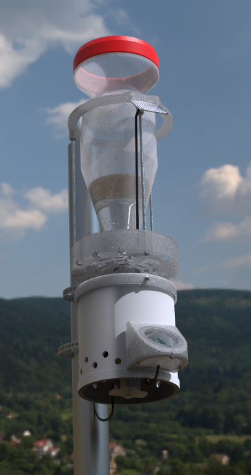

To change language:&nbsp;&nbsp;

# Datos²

## Introducción

El proyecto Datos² es un desarrollo científico tecnológico que está brindando una herramienta y una plataforma para proyectos de ciencia ciudadana y la comunidad en general. El dispositivo que ofrece es Open-Source con el fin de recolectar, almacenar y compartir datos ambientales que se visualizan en la plataforma.

Buscamos que cada uno pueda apropiarse del proyecto de la manera más conveniente, generando un impacto en el presente y futuro de nuestra sociedad. Para ello diseñamos SEHMA (Sistema Educativo Hidro Metrológico y Ambiental) formada por diversos sensores que podrán ser incorporados según las necesidades de las comunidades, y por una telemetría que se encargará de subir los datos a una plataforma web para su visualización. Desde aquí, toda la comunidad podrá utilizar los datos generados para distintos proyectos o necesidades.

## SEHMA

El dispositivo SEHMA es un sistema educativo meteorológico de bajo costo, fácil ensamble y con componentes accesibles, que permite a cualquier persona armar su propia SEHMA. La estructura principal consta de piezas de contención impresas en 3D y una placa de control con comunicación GPRS que permite la lectura de sensores y carga de datos a la red. 
Tiene las siguientes funciones y sensores:
 
 
 
- Pluviómetro totalizador que mide el volumen de agua acumulada durante el evento
- Sensor Ultravioleta que mide la radiación UV global
-  Sensor de temperatura
- Sensor de humedad
- Panel solar que permite autonomía a través de energía renovable
 
 

### Componentes Electrónicos

<table align="center">
  <thead>
    <tr>
      <th>Componentes</th>
      <th>Cantidad</th>
      <th>Enlace de Compra</th>
    </tr>
  </thead>
  <tbody>
    <tr>
      <td>Arduino Nano</td>
      <td align="center">1</td>
      <td><a href="https://articulo.mercadolibre.com.ar/MLA-1117390716-atmel-nano-v30-atmega328-usb-compatible-ch340-cable-usb-_JM#position=4&search_layout=grid&type=item&tracking_id=72562e09-0b68-4055-bb07-b63051b15a30">Arduino Nano</a></td>
    </tr>
    <tr>
      <td>Modulo Step-Up MT3608</td>
      <td align="center">1</td>
      <td><a href="https://articulo.mercadolibre.com.ar/MLA-677999119-fuente-step-up-mt3608-dc-dc-booster-hasta-28v-arduino-_JM#position=5&search_layout=grid&type=item&tracking_id=8fe16bd9-8071-4581-baf5-30e2aaf3523e">MT3608</a></td>
    </tr>
    <tr>
      <td>Modulo Driver Mosfet IRF520 24V 9A</td>
      <td align="center">1</td>
      <td><a href="https://articulo.mercadolibre.com.ar/MLA-732240129-modulo-driver-mosfet-irf520-24v-9a-controlador-arduino-pic-_JM#position=2&search_layout=grid&type=item&tracking_id=4971c395-66a7-4063-87e5-2919493828b4">IRF520</a></td>
    </tr>
    <tr>
      <td>Sensor de Lluvia Raindrop</td>
      <td align="center">1</td>
      <td><a href="https://articulo.mercadolibre.com.ar/MLA-628919809-sensor-de-lluvia-raindrop-nivel-de-agua-gotas-arduino-pic-_JM#position=1&search_layout=stack&type=item&tracking_id=30c9dd6e-3289-46bd-bf59-e12049e01e5d">Raindrop</a></td>
    </tr>
    <tr>
      <td>Reloj de Tiempo Real RTC DS1307 EEPROM 24C32</td>
      <td align="center">1</td>
      <td><a href="https://articulo.mercadolibre.com.ar/MLA-652467602-reloj-tiempo-real-rtc-ds1307-eeprom-24c32-arduino-todom">DS1307</a></td>
    </tr>
    <tr>
      <td>Baterías 18650 Samsung 3000 mA</td>
      <td align="center">2</td>
      <td><a href="https://www.mercadolibre.com.ar/pila-samsung-inr18650-30q-cilindrica-1-unidad/p/MLA16952001#searchVariation=MLA16952001&position=1&search_layout=stack&type=product&tracking_id=262fdb61-1f61-41e8-b207-c581f31320b5">Bateria Samsung</a></td>
    </tr>
    <tr>
      <td>Holder para baterías 18650</td>
      <td align="center">2</td>
      <td><a href="https://articulo.mercadolibre.com.ar/MLA-810911247-10-portapilas-holder-bateria-18650-portapila-pack-x-10-_JM#position=36&search_layout=stack&type=item&tracking_id=58fa4027-1cb1-4b2d-b6bb-21a118f22569">Holder Baterías</a></td>
    </tr>
    <tr>
      <td>Sensor de Humedad y Temperatura DHT22</td>
      <td align="center">1</td>
      <td><a href="https://articulo.mercadolibre.com.ar/MLA-767685589-dht-22-sensor-humedad-y-temperatura-arduino-raspberry-_JM#position=1&search_layout=grid&type=item&tracking_id=bb4ca5b0-af4a-41e8-9012-47ee587c1c7a">DHT22</a></td>
    </tr>
    <tr>
      <td>Sensor de Luz Ultravioleta ML8511</td>
      <td align="center">1</td>
      <td><a href="https://articulo.mercadolibre.com.ar/MLA-921895103-modulo-sensor-luz-ultravioleta-uv-ml8511-arduino-_JM#position=6&search_layout=grid&type=item&tracking_id=b31fa0ab-c297-4237-8fd0-921482750ff8">ML8511</a></td>
    </tr>
    <tr>
      <td>Modem A6 Mini o SIM800L para Telecomunicaciones</td>
      <td align="center">1</td>
      <td><a href="https://articulo.mercadolibre.com.ar/MLA-1437846022-modulo-gprs-a6-mini-cuatribanda-sms-gsm-gprs-ideal-arduino-_JM#position=31&search_layout=stack&type=item&tracking_id=b92e1ad1-eb10-41e8-8f06-538f5c0ab563">A6</a> | <a href="https://articulo.mercadolibre.com.ar/MLA-1308505021-modulo-celular-gsm-gprs-sim800l-sim800-domotica-arduino-ubot-_JM#position=1&search_layout=grid&type=item&tracking_id=351d4014-7b06-4f31-87f1-ae97d6f6fd73">SIM800L</a></td>
    </tr>
    <tr>
      <td>Cargador Solar CN3791</td>
      <td align="center">1</td>
      <td><a href="https://articulo.mercadolibre.com.ar/MLA-1106257985-cargador-bateria-lipo-uso-panel-solar-cn3791-arduino-elegir-_JM#position=30&search_layout=stack&type=item&tracking_id=802ccaf1-c51f-4cb6-aa45-b20c71b1849a">CN3791</a></td>
    </tr>
    <tr>
      <td>Celda de Carga de 10 Kg + Driver HX711</td>
      <td align="center">1</td>
      <td><a href="https://articulo.mercadolibre.com.ar/MLA-733004040-celda-de-carga-10kg-con-amplificador-hx711-arduino-candy-_JM#position=14&search_layout=grid&type=item&tracking_id=8e1c6a0c-bf37-4eee-bc3d-d1f6ae97d8ef">HX711</a></td>
    </tr>
      <tr>
      <td>Kit Molex x 2 Pines</td>
      <td align="center">1</td>
      <td><a href="https://articulo.mercadolibre.com.ar/MLA-1530414156-kit-x-30u-2-pin-terminal-molex-hembra-macho-y-pines-htec-_JM#position=3&search_layout=grid&type=item&tracking_id=feedb67d-d999-4e10-83dc-8528ae580bf2">Kit Molex x 2</a></td>
    </tr>
     <tr>
      <td>Kit Molex x 3 Pines</td>
      <td align="center">3</td>
      <td><a href="https://articulo.mercadolibre.com.ar/MLA-1547547796-kit-x-30u-3-pin-terminal-molex-hembra-macho-y-pines-htec-_JM#position=51&search_layout=stack&type=item&tracking_id=4f2edef0-6c5c-400e-8229-65fce00075ec">Kit Molex x 3</a></td>
    </tr>
     <tr>
      <td>Kit Molex x 4 Pines</td>
      <td align="center">1</td>
      <td><a href="https://articulo.mercadolibre.com.ar/MLA-1544835568-kit-x-30u-4-pin-terminal-molex-hembra-macho-y-pines-htec-_JM#position=1&search_layout=grid&type=item&tracking_id=8ec89334-1835-4339-9225-2a076de11fa3">Kit Molex x 4</a></td>
    </tr>
     <tr>
      <td>Kit Molex x 5 Pines</td>
      <td align="center">1</td>
      <td><a href="https://articulo.mercadolibre.com.ar/MLA-1548402732-kit-x-30u-5-pin-terminal-molex-hembra-macho-y-pines-htec-_JM#position=2&search_layout=grid&type=item&tracking_id=0542de33-9c89-4d24-a9b2-bdc8694cdf21">Kit Molex x 5</a></td>
    </tr>
     <tr>
      <td>Resistencias 10K Ω</td>
      <td align="center">2</td>
      <td><a href="https://articulo.mercadolibre.com.ar/MLA-841986521-10-x-resistencias-10k-ohm-1-14w-metal-film-_JM#position=8&search_layout=grid&type=item&tracking_id=424a52a9-8c38-42ca-8fbc-487ac3932614">Resistencias</a></td>
    </tr>
    <tr>
      <td>Tira Pines Hembra</td>
      <td align="center">2</td>
      <td><a href="https://articulo.mercadolibre.com.ar/MLA-879655442-tira-de-40-pines-hembra-paso-254mm-recta-1-fila-_JM#position=4&search_layout=grid&type=item&tracking_id=f194ae8c-4a52-457f-882d-bc9aa2cb7714">Tira Pines Hembra</a></td>
    </tr>
    <tr>
      <td>Interruptor Encendido/Apagado</td>
      <td align="center">1</td>
      <td><a href="https://articulo.mercadolibre.com.ar/MLA-1457486094-llave-electronica-tecla-interruptora-redonda-alcides-2500-_JM#position=1&search_layout=stack&type=item&tracking_id=a7d7d1b3-e35b-4af4-bd44-98e7a9482798">Interruptor</a></td>
    </tr>
    <tr>
      <td>Antena 3G</td>
      <td align="center">1</td>
      <td><a href="https://tienda.ityt.com.ar/antenas-gsm-2g-3g-4g/8259-antena-modem-2g-3g-4g-lte-exterior-cable-5m-sma-itytarg.html">Antena</a></td>
    </tr>
    <tr>
      <td>Adaptador Pigtail</td>
      <td align="center">1</td>
      <td><a href="https://articulo.mercadolibre.com.ar/MLA-740053599-cable-pigtail-ufl-ipx-a-sma-hembra-cable-antena-15-cm-_JM#position=2&search_layout=stack&type=item&tracking_id=59d777cc-f65b-4182-b457-41c2329058b1">Pigtail SMA a U.fl</a></td>
    </tr>
    <tr>
      <td>Pila CR2032</td>
      <td align="center">1</td>
      <td><a href="https://articulo.mercadolibre.com.ar/MLA-840122267-5-x-pilas-boton-cr2032-vinnic-2032-san-martin-caseros-_JM#position=12&search_layout=stack&type=item&tracking_id=319399d4-d1e2-4e31-b8e0-133f9c6257ec">Pila</a></td>
    </tr>
    <tr>
      <td>Chip Prepago</td>
      <td align="center">1</td>
      <td><a href="https://articulo.mercadolibre.com.ar/MLA-1248406422-chip-prepago-movistar-personal-claro-tuenti-gsm-4g-_JM#position=5&search_layout=stack&type=item&tracking_id=6764688f-a6c5-4715-9250-fc3602753aae">Chip</a></td>
    </tr>

  </tbody>
</table>

### Estructura

A la estructura se la pensó a partir de dos líneas de trabajo. La primera es en impresión 3D, que nos permite la replicación exacta en cada sistema.

>[!IMPORTANT]
>**Configuración de Impresión:**
>- Altura de Capa: 0,2 mm
>- Relleno: 30% al 50%
>- Líneas de pared: 3
>- Capas de Superficie: 3

<table align="left">
  <thead>
    <tr>
      <th colspan="3">Pluviometro</th>
    </tr>
  </thead>
    <thead>
    <tr>
      <th>Pieza</th>
      <th>Peso [g]</th>
      <th>Cantidad</th>
    </tr>
  </thead>
  <tbody>
    <tr>
      <td>Aro</td>
      <td align="center">31</td>
      <td align="center">1</td>
    </tr>
    <tr>
      <td>Estanco A</td>
      <td align="center">3</td>
      <td align="center">1</td>
    </tr>
    <tr>
      <td>Estanco B</td>
      <td align="center">4</td>
      <td align="center">1</td>
    </tr>
    <tr>
      <td>Localizador</td>
      <td align="center">24</td>
      <td align="center">1</td>
    </tr>
    <tr>
      <td>Ménsula</td>
      <td align="center">6</td>
      <td align="center">1</td>
    </tr>
    <tr>
      <td>Tapa</td>
      <td align="center">13</td>
      <td align="center">1</td>
    </tr>
    <tr>
      <td>Totalizador Pluviómetro</td>
      <td align="center">81</td>
      <td align="center">1</td>
    </tr>
  </tbody>
</table>

<table align="right">
  <thead>
    <tr>
      <th colspan="3">Telemetria</th>
    </tr>
  </thead>
    <thead>
    <tr>
      <th>Pieza</th>
      <th>Peso [g]</th>
      <th>Cantidad</th>
    </tr>
  </thead>
  <tbody>
    <tr>
      <td>Holder Cargador</td>
      <td align="center">2</td>
      <td align="center">1</td>
    </tr>
    <tr>
      <td>Holder Step-Up</td>
      <td align="center">2</td>
      <td align="center">1</td>
    </tr>
    <tr>
      <td>Pieza en T</td>
      <td align="center">11</td>
      <td align="center">1</td>
    </tr>
    <tr>
      <td>Placa Porta pila</td>
      <td align="center">23</td>
      <td align="center">1</td>
    </tr>
    <tr>
      <td>Separador</td>
      <td align="center">1</td>
      <td align="center">3</td>
    </tr>
    <tr>
      <td>Tapa Inferior</td>
      <td align="center">31</td>
      <td align="center">1</td>
    </tr>
    <tr>
      <td>Tapa Superior</td>
      <td align="center">88</td>
      <td align="center">1</td>
    </tr>
    <tr>
      <td>Topes</td>
      <td align="center">5</td>
      <td align="center">3</td>
    </tr>
  </tbody>
</table>

<table align="left">
  <thead>
    <tr>
      <th colspan="3">UV</th>
    </tr>
  </thead>
    <thead>
    <tr>
      <th>Pieza</th>
      <th>Peso [g]</th>
      <th>Cantidad</th>
    </tr>
  </thead>
  <tbody>
    <tr>
      <td>Base</td>
      <td align="center">10</td>
      <td align="center">1</td>
    </tr>
    <tr>
      <td>Cuerpo</td>
      <td align="center">44</td>
      <td align="center">1</td>
    </tr>
    <tr>
      <td>Tapa</td>
      <td align="center">2</td>
      <td align="center">1</td>
    </tr>
  </tbody>
</table>

<table align="right">
  <thead>
    <tr>
      <th colspan="3">Agarre</th>
    </tr>
  </thead>
    <thead>
    <tr>
      <th>Pieza</th>
      <th>Peso [g]</th>
      <th>Cantidad</th>
    </tr>
  </thead>
  <tbody>
    <tr>
      <td>Fijacion</td>
      <td align="center">38</td>
      <td align="center">1</td>
    </tr>
    <tr>
      <td>Mariposa</td>
      <td align="center">3</td>
      <td align="center">4</td>
    </tr>
    <tr>
      <td>Traba</td>
      <td align="center">38</td>
      <td align="center">1</td>
    </tr>
  </tbody>
</table>

La otra línea de trabajo sobre la que se pensó es en materiales que se puedan conseguir fácilmente en una ferretería, que a su vez conserva la calidad que se requiere para que funcione correctamente el sistema.

<table align="center">
  <thead>
    <tr>
      <th>Producto</th>
      <th>Medida</th>
      <th>Cantidad</th>
    </tr>
  </thead>
  <tbody>
   <tr>
      <td>Cable Cuatro Polos</td>
      <td align="center">6 m</td>
      <td align="center">1</td>
    </tr>
    <tr>
      <td>Philips o Punta Plana</td>
      <td align="center">M3 x 8mm   M3 x 30mm   M4 x 16mm   M4 x 75mm</td>
      <td align="center">14   1   4   3  </td>
    </tr>
    <tr>
      <td>Varilla</td>
      <td align="center">M4 x 210mm  M4 x 60mm</td>
      <td align="center">3   3</td>
    </tr>
    <tr>
      <td>Tuerca</td>
      <td align="center">M4   M3   M6</td>
      <td align="center">16   1   1</td>
    </tr>
    <tr>
      <td>Tornillo</td>
      <td align="center">M6 x 50mm</td>
      <td align="center">1</td>
    </tr>
    <tr>
      <td>Tubo Unión entre 2</td>
      <td align="center">4"</td>
      <td align="center">1</td>
    </tr>
    <tr>
      <td>Brida Acero</td>
      <td align="center">Para 4"</td>
      <td align="center">3</td>
    </tr>
    <tr>
      <td>O' Ring</td>
      <td align="center">W2,6 mm x D105 mm</td>
      <td align="center">2</td>
    </tr>
    <tr>
      <td>Vidrio Repuesto Lente Soldadura</td>
      <td align="center">Estándar</td>
      <td align="center">1</td>
    </tr>
    <tr>
      <td>Prensa Cable</td>
      <td align="center">1/2"</td>
      <td align="center">6</td>
    </tr>
    <tr>
      <td>Pluviómetro</td>
      <td align="center">-</td>
      <td align="center">1</td>
    </tr>
    <tr>
      <td>Ciano acrilato</td>
      <td align="center">-</td>
      <td align="center">1</td>
    </tr>
    <tr>
      <td>Silicona</td>
      <td align="center">-</td>
      <td align="center">-</td>
          <tr>
      <td>Pintura Latex</td>
      <td align="center">-</td>
      <td align="center">-</td>
    </tr>
  </tbody>
</table>

## Armado PCB

Para comenzar a armar el sistema, hay que preparar el PCB (Placa de Circuito Impreso) con el siguiente [circuito](Hardware/PCB_Datos2.pdf). Si no sabes cómo prepararla, haz clic [aquí](https://youtu.be/MX9_9U6Wnu8?si=8ijrH3XqB462RJCx&t=36).

Al ya tener la placa lista, perforando con una mecha de 1mm, debería verse así:

<table align="center">
  <thead>
    <tr>
      <th></th>
      <th></th>
    </tr>
  </thead>
  <tbody>
    <tr>
      <td align="center">Placa desde Abajo</td>
      <td align="center">Placa desde Arriba</td>
    </tr>
  </tbody>
</table>

 

>[!IMPORTANT]
>Hay que estar seguro de que no se hayan cometido errores durante el proceso, así que con un multímetro en modo continuidad se puede verificar que no haya cortocircuitos entre Vcc y GND, como también entre cada uno de los pines de los componentes.

### **Paso 1** - Componentes

Ten a mano todos los componentes necesarios para la placa. Se recomienda probar que cada uno de ellos esté funcionando correctamente. A continuación, se presenta una imagen con cada uno. (Faltan componentes, después le saco foto)

 

### **Paso 2** - Soldadura

      

Con un soldador de estaño como [este](https://www.mercadolibre.com.ar/soldador-de-estano-30w-tipo-lapiz-punta-ceramica-zurich-profesional-para-electronica-y-electricidad/p/MLA24319090?pdp_filters=category:MLA455278#searchVariation=MLA24319090&position=2&search_layout=stack&type=product&tracking_id=12611802-c75b-4189-8a99-06b5f4bf6936), procede a soldar los componentes más bajos en altura primero, siguiendo por lo más altos. Si no sabes cómo soldar, haz clic [aquí](https://www.youtube.com/watch?v=snM_ABjXGsw). La placa se debería ver así al terminar: 

         

### **Paso 3** - Integración

  

Ahora lo que hay que hacer es cargar el [programa](Firmware/Estacion_v1.4_1hora/Estacion_v1.4_1hora.ino) en la Arduino e insertar cada componente (habiendo asegurado que funcionan correctamente) en su lugar. Colocar el chip en el modem y [pila en el RTC](Imagenes/PCB/Posicion%20Pila%20RTC.jpg).
Finalmente, colocar el prensa cables en la antena y, a travez del pigtail, conectarlo al modem.

Para [colocar el prensa cables en la antena](Imagenes/PCB/Prensa%20Cables%20para%20Antena.jpg), hay que primero perforar el prensa cables con una mecha de 9,5 mm (sacarle la goma prensadora). Luego donde se sujetará el prensa cables, dar 6 o 7 vueltas de cinta aislante para engrosar el cable y asegurar el correcto funcionamiento del prensador.

      

## Ensamblaje Sistema

Para comenzar a armar el sistema, hay que ya haber terminado la placa, como a su vez ya tener impreso y compradas todas las [piezas](Impresion%203D%20STL/) detalladas en este documento.    

### **Paso 1** - Preparar sistema de Autonomía

  

<picture>
  <source media="(prefers-color-scheme: dark)" srcset="https://github.com/ProyectoDatos2/Datos2/blob/Readme-Writing/Imagenes/Ensamble/Sistema%20de%20Autonom%C3%ADa/Base%20PortaPila%20Completa%20-%20Blanco.png">
  <source media="(prefers-color-scheme: light)" srcset="https://github.com/ProyectoDatos2/Datos2/blob/Readme-Writing/Imagenes/Ensamble/Sistema%20de%20Autonom%C3%ADa/Base%20PortaPila%20Completa%20-%20Negro.png">
  
</picture>

   

El sistema de autonomía está formado por: 
- Dos baterías 18650
- Placa de Step Up 
- Módulo de carga solar 

Todo el conjunto esta sostenido por la [placa base portapilas](Impresion%203D%20STL/Telemetría/Tel_Placa%20Portapilas.STL) y a su vez la placa de Step Up esta sobre el [holder Step Up](Impresion%203D%20STL/Telemetría/Tel_Holder%20Step%20Up.STL) y el módulo de carga solar esta sobre el [holder cargador](Impresion%203D%20STL/Telemetría/Tel_Holder%20Cargador.STL). El sistema unido por la gotita debería quedar como la imagen a la izquierda.

   

El cableado debe ser al ras asi los cables no nos quedan incomodos al unir los sistemas con tornillos. Para eso hay que seguir los siguientes pasos: 

1. Primero hay que [pasar el cable positivo](Imagenes/Ensamble/Sistema%20de%20Autonomía/Cable%20Positivo%20por%20Abajo.jpg) por debajo del cargador solar para luego [empalmarlo](Imagenes/Ensamble/Sistema%20de%20Autonomía/Empalme%20Positivos.jpg). A todos los empalmes se los aísla con un aislante termo-contraíble.

2. Luego, [empalmar los cables negativos](Imagenes/Ensamble/Sistema%20de%20Autonomía/Empalme%20Negativos.jpg) con ese largo, asi no molestan con el hueco para el tornillo. Pegarlo con la gotita al holder si es necesario.

3. Con cables trenzados positivos, desde la otra salida de batería del cargador solar, llevar hasta el interruptor y devuelta a la entrada positiva del modulo step up. 

4. Cerca de los cables negativos anteriores, desde la misma entrada que el paso anterior, llevar el cable negativo a la entrada negativa del [modulo de step up](Imagenes/Ensamble/Sistema%20de%20Autonomía/Cable%20Negativo%20a%20Step%20Up.jpg). 

5. Para el conexionado del panel solar al sistema, se debe seguir la siguiente [imagen](Imagenes/Ensamble/Sistema%20de%20Autonomía/Conexionado%20Panel%20Solar.jpg).

6. Por último, insertar las baterías para regular el módulo de step up [con un multimetro](Imagenes/Ensamble/Sistema%20de%20Autonomía/Regulacion%20de%20Step%20Up.jpg).

     

Con las pilas ya puestas y desde otra perspectiva: 

           

El conexionado de este sistema es bastante simple, solo hay que seguir el [esquematico](Imagenes/Ensamble/Sistema%20de%20Autonomía/Conexionado%20Sistema%20de%20Autonomia.jpg) adjunto. Al accionar el interruptor, se debería prender todo el sistema. 

### **Paso 2** - Preparar sensor UV

Para la estructura sensor UV se necesita:

- [Base Sensor UV](Impresion%203D%20STL/UV/UV_Base.STL)
- [Cuerpo Sensor UV](Impresion%203D%20STL/UV/UV_Cuerpo.STL)
- [Tapa Sensor UV](Impresion%203D%20STL/UV/UV_Tapa.STL)
- [Lente Sensor UV](Imagenes/Ensamble/Conjunto%20UV/Lente%20Sensor%20UV.jpg)
- Sensor UV 8511
- 1 m de cable de 4 polos
- 4 tornillos M3 x 8 mm

1. Primero se debe soldar los cables en el orden indicado en esta [imagen](Imagenes/Ensamble/Conjunto%20UV/Conexión%20sensor%20UV.png). Asegurarse de que la soldadura sea del mismo lado que el integrado.
2. Luego, atornillar el sensor a la base del sensor como se ve en esta [imagen](Imagenes/Ensamble/Conjunto%20UV/Colocación%20Sensor%20UV.png).
3. Finalmente, ajustar los tornillos inferiores entre la base y el cuerpo, para luego pegar con la gotita el lente y asegurarlo con la tapa para que quede como la imagen a la derecha (deben coincidir las muescas de la tapa y el cuerpo).

El conjunto se deberia ver de [esta manera](Imagenes/Ensamble/Conjunto%20UV/Posicion%20Sensor%20UV.jpg) al estar en el sistema final.

### **Paso 3** - Preparar Pluviómetro

Para el conjunto del pluviómetro se precisa de lo siguiente:

- [Aro Totalizador](Impresion%203D%20STL/Pluviómetro/Pluv_Aro.STL)
- [Ménsula](Impresion%203D%20STL/Pluviómetro/Pluv_Mensula.STL)
- [Tapa](Impresion%203D%20STL/Pluviómetro/Pluv_Tapa.STL)
- [Totalizador](Impresion%203D%20STL/Pluviómetro/Pluv_Totalizador.STL)
- [Estanco A](Impresion%203D%20STL/Pluviómetro/Pluv_Estanco%20A.STL)
- [Estanco B](Impresion%203D%20STL/Pluviómetro/Pluv_Estanco%20B.STL)
- [Localizador](Impresion%203D%20STL/Pluviómetro/Pluv_Localizador.STL)
- Celda de Carga + Driver HX711
- 13 Tuercas M4
- 4 Tornillos M4 x 16 mm
- 3 Varillas M4 de 210 mm
- 4 Tornillos M3
- 0,5 m de cable de 4 polos

1. Hay que colocar las varillas de 210 mm en el aro totalizador, asegurando que el aro quede a nivel con respecto el suelo como se muestran las imágenes de ejemplo al final de la sección.

2. Del lado de la muesca en el aro, [se inserta la ménsula](Imagenes/Ensamble/Conjunto%20Pluviómetro/Colocación%20Mensula.jpg), sujetada tambien por otra rosca.

3. Se colocan las [arandelas y tornillos](Imagenes/Ensamble/Conjunto%20Pluviómetro/Arandelas%20Localizador.jpg) y se [atornilla](Imagenes/Ensamble/Conjunto%20Pluviómetro/Orientacion%20Localizador.jpg) sobre la cara contraria a la flecha del peso de la celda de carga

4. Sobre el totalizador, se coloca la celda de carga con la [orientación correcta](Imagenes/Ensamble/Conjunto%20Pluviómetro/Orientación%20Celda%20de%20Carga.jpg) y se [atornilla desde abajo](Imagenes/Ensamble/Conjunto%20Pluviómetro/Tornillos%20Celda%20de%20Carga.jpg).

5. Conectar la [celda de carga al driver](Imagenes/Ensamble/Conjunto%20Pluviómetro/Conexión%20Celda%20de%20Carga.png) y los cables de entrada/salida del otro lado (acordarse como conectó cada cable porque luego esto queda sellado).

6. Guardar el driver [dentro de los estancos A y B](Imagenes/Ensamble/Conjunto%20Pluviómetro/Colocación%20Driver%20Celda%20de%20Carga.jpg) y [posicionar al lado de la celda](Imagenes/Ensamble/Conjunto%20Pluviómetro/Colocacion%20Driver%20Celda%20de%20Carga%202.jpg) para luego [colocar la tapa sobre ambos](Imagenes/Ensamble/Conjunto%20Pluviómetro/Colocación%20Tapa.jpg).

7. Luego de esto, hay que asegurarse que no haya pesos "fantasma" en la celda, asi que se usará el Arduino para ajustar la tara de la celda.

8. Ya casi terminando, inserte primero las contra roscas en las varillas, para luego colocar el aro en el totalizador, ajustando tambien roscas del [lado contrario](Imagenes/Ensamble/Conjunto%20Pluviómetro/Roscas%20por%20Abajo.jpg) y que las varillas queden al ras del piso del totalizador, asi queda a nivel el aro. Volver a comprobar el nivel del aro y hacer ajustes necesarios en caso de que no esté a nivel.

<table align="center">
  <thead>
    <tr>
      <th></th>
      <th></th>
      <th></th>
    </tr>
  </thead>
</table>

9. Para finalizar, [conectar sensor raindrop](Imagenes/Ensamble/Conjunto%20Pluviómetro/Conexion%20Sensor%20Raindrop.png) y [colocar sobre la mensula](Imagenes/Ensamble/Conjunto%20Pluviómetro/Pintado%20y%20Colocacion%20Sensor%20Raindrop.png) pintando con la pintura latex por encima del sensor y ajustando con los tornillos M3.

### **Paso 4** - Integración Sistemas Eléctricos

Ya teniendo completados todos los pasos anteriores, lo único que queda es unir cada uno de los sistemas individuales. Necesitaremos las siguientes piezas:

- [Tapa Inferior](Impresion%203D%20STL/Telemetría/Tel_Tapa%20Inferior.STL)
- [Separador PCB a Techo Pila](Impresion%203D%20STL/Telemetría/Tel_Separador.STL)
- [Tapa Superior](Impresion%203D%20STL/Telemetría/Tel_Tapa%20Superior.STL)
- [Tope Interno](Impresion%203D%20STL/Telemetría/Tel_Tope.STL)
- [Pieza en T](Impresion%203D%20STL/Telemetría/Tel_Pieza%20T.STL)
- Conjunto UV
- Conjunto Pluviómetro
- PCB Terminada
- Interruptor
- Prensa Cables
- O’ Ring 
- Cable unipolar (Medición de carga de Batería)
- 3 Tuercas M4

1. Para comenzar, lo que haremos es colocar el O-Ring, [enroscar las varillas](Imagenes/Ensamble/Sistema%20General/O'Ring%20Colocación.jpg) de 60 mm y [atornillar la pieza en T](Imagenes/Ensamble/Sistema%20General/Colocación%20Pieza%20en%20T.jpg) en la Tapa Inferior.

2. Insertar los prensa cables y el interruptor de encendido como se muestra en las imágenes de abajo

  

  

                  

3. Cortar pines del DHT a la mitad, soldar los cables del cable de 4 o 6 polos y pasar una película de [laca](https://www.google.com/search?q=laca+delta+electroquimica&tbm=isch&ved=2ahUKEwjtp9-atLKDAxXlhJUCHatYAYcQ2-cCegQIABAA&oq=laca+delta+electroquimica&gs_lcp=CgNpbWcQAzoECCMQJzoKCAAQgAQQigUQQzoFCAAQgAQ6BggAEAgQHjoHCAAQgAQQGDoJCAAQgAQQGBAKUL8MWIopYO4paABwAHgAgAFniAGfD5IBBDIwLjGYAQCgAQGqAQtnd3Mtd2l6LWltZ8ABAQ&sclient=img&ei=AY-NZa2jG-WJ1sQPq7GFuAg&bih=945&biw=1920&rlz=1C1ALOY_esAR997AR998#imgrc=js21fCIKTrFWCM) o un termo contraíble para que la humedad no interfiera. Se debería ver [asi](Imagenes/Ensamble/Sistema%20General/Preparado%20AHT.jpg).

3. Pegar con la gotita el sensor DHT sobre la pieza en T, como se puede ver en esta [imagen](Imagenes/Ensamble/Sistema%20General/Colocación%20Sensor%20AHT.jpg)

4. Luego de pasar cada uno de los respectivos cables por los prensa cables, se tiene que agregar un cable del lado normalmente abierto del interruptor, el cual se une después a uno de los conectores molex que van conectados a la placa.

5. Armar cada uno de los molex (si no sabe cómo, [aquí](https://www.youtube.com/watch?v=tU62sOKsNWI) hay un tutorial), y coloque el PCB de la siguiente manera:

  

  

  
                    

  A continuación, se detalla cada una de las posiciones de los cables del molex:

<table align="center">
  <thead>
    <tr>
      <th>Sensor</th>
      <th>Números de Pin Molex</th>
      <th>Función del Pin</th>
    </tr>
  </thead>
  <tbody>
    <tr>
      <td>Totalizador Lluvia</td>
      <td align="center">1 2 3 4</td>
      <td align="center">CLK DOUT GND 5 V</td>
    </tr>
    <tr>
      <td>UV</td>
      <td align="center">5 6 7 8 9</td>
      <td align="center">GND 3v3 ENABLE NC OUT UV</td>
    </tr>
    <tr>
      <td>Batería + Raindrop</td>
      <td align="center">10 11 12</td>
      <td align="center">V BAT (Cable que viene del Interruptor) Pin Lluvia 1 Pin Lluvia 2</td>
    </tr>
    <tr>
      <td>DHT</td>
      <td align="center">1 2 3</td>
      <td align="center">OUT GND 5 V</td>
    </tr>
    <tr>
      <td>Alimentación</td>
      <td align="center">1 2</td>
      <td align="center">5 V GND</td>
    </tr>
  </tbody>
</table>

6. Al terminar con el paso anterior, estando seguro de que cada conector se haya armado correctamente, se [colocan los separadores](Imagenes/Ensamble/Sistema%20General/Separadores%20Colocados.png) entre el PCB y la placa del sistema de autonomía, para que luego se inserte el sistema y se ajusten las tuercas correspondientes:

## **Paso 5** - Integración Final

Para este paso se necesita:

- Integración Sistemas Eléctricos Terminado
- [Tubo 4" Unión entre 2](Imagenes/Ensamble/Sistema%20General/Tubo%20Union%20entre%202.jpg)
- O’ Ring 
- WD40
- 3 tornillos M3
- 3 tornillos M4

1. De ser posible, agujerear huecos de 15 mm cada 45 mm alrededor de la base del tubo, en dos hileras con una distancia de 20 mm desde los centros.

2. [Insertar O'Ring](Imagenes/Ensamble/Sistema%20General/Tapa%20con%20O'Ring.jpg) y pegar con Ciano los topes como se observa en la imagen.

3. [Colocar Tapa](Imagenes/Ensamble/Sistema%20General/Tubo%20Union%20entre%202%20con%20Tapa.jpg) sobre el tubo y atornillar.

4. Insertar los sistemas eléctricos. Se recomienda aplicar WD40 sobre el O’ Ring para que deslice más fácilmente. Al encajar, ajuste los tornillos sobre los topes para que quede sujetado.
